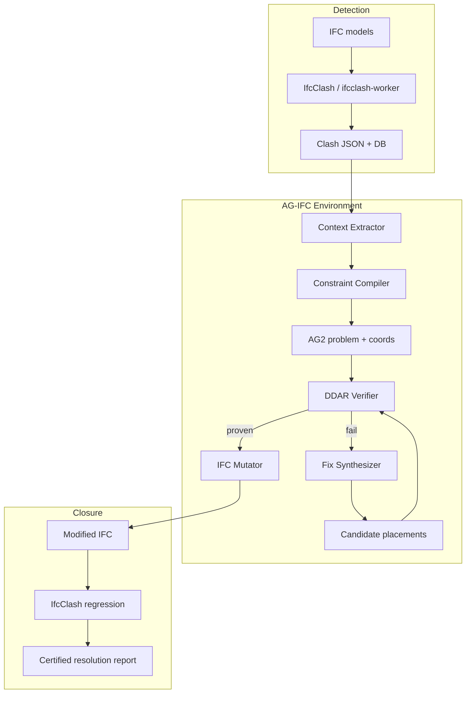

# AlphaGeometry × IfcOpenShell × IfcClash: Research & Integration Plan

**Status:** Research / architecture proposal  
**Repo context:** IfcPipeline (`ifcclash-worker`, `ifcpatch-worker`, API gateway, n8n)  
**Date:** 2026-05-26

---

## 1. Executive summary

The vision—**detect clashes with IfcClash, understand geometry in context, propose fixes, and certify them before human review**—is sound. The critical research finding is that **AlphaGeometry cannot operate on IFC files directly**. It operates on problems expressed in a **specialized 2D Euclidean geometry language** (points, lines, circles, incidence, perpendicularity, etc.), with optional numeric coordinates, proved by **DDAR** (symbolic) plus an LM for auxiliary constructions (neural).

The **missing piece** is not “install AlphaGeometry next to IfcOpenShell.” It is a dedicated **bridge environment** we call **AG-IFC** (AlphaGeometry ↔ IFC):

| Layer | Role | Technology |
|-------|------|------------|
| Detection | Find conflicts | **IfcClash** (already in `ifcclash-worker`) |
| Context | Localize clash, extract axes/sections | **IfcOpenShell** geom + placement |
| Formalization | Express design intent as provable relations | **AG-IFC Constraint Compiler** (new) |
| Certification | Prove relations hold | **DDAR** (AG / AG2) |
| Synthesis | Propose routing/offsets | **Optimizer / pathfinder** (not AG alone) |
| Application | Write back to model | **IfcPatch / IfcEdit / ifcmcp** |
| Regression | Confirm clash cleared | **IfcClash** again |

**AlphaGeometry’s highest-value role in BIM is verification and explanation**, not raw 3D mesh routing. Fix generation should be a **hybrid**: numerical/optimization engine proposes moves; DDAR **certifies** that the proposed state satisfies stated geometric rules in the chosen abstraction.

> **Naming note:** This document assumes **IfcClash** (IfcOpenShell) where the brief says “ISE Clash.” No widely used BIM product named “ISE Clash” was found; if you mean a specific vendor tool, the same pipeline applies by normalizing its output into the clash JSON schema IfcPipeline already consumes.

---

## 2. What AlphaGeometry actually is (constraints)

### 2.1 Public artifacts

| Artifact | URL | What you get |
|----------|-----|----------------|
| AlphaGeometry (v1) | [google-deepmind/alphageometry](https://github.com/google-deepmind/alphageometry) | DDAR + LM, Olympiad DSL, JAX/meliad |
| AlphaGeometry2 | [google-deepmind/alphageometry2](https://github.com/google-deepmind/alphageometry2) | Stronger **DDAR**; AG2 language (distances, angle/ratio relations); **no hosted API** |
| IfcClash / IfcMCP | [IfcOpenShell docs](https://docs.ifcopenshell.org/ifcclash.html) | Clash detection, MCP `ifc_clash`, `ifc_edit` |

There is **no Google-hosted AlphaGeometry API**. Integration is **self-hosted**: clone repos, weights (v1), run `python -m alphageometry` or AG2 `python -m test`.

### 2.2 Problem format (why IFC does not fit)

AG problems look like Olympiad sketches, e.g. from `examples.txt`:

```text
a b c = triangle a b c; d = on_tline d b a c, on_tline d c a b ? perp a d b c
```

Primitives are **abstract points** and relations (`coll`, `perp`, `cong`, `para`, `on_line`, …) defined in `defs.txt` / `rules.txt`. The engine:

1. Builds a **proof state graph** (`graph.py`, `geometry.py`).
2. Runs **DD+AR** deduction (`ddar.py`).
3. Optionally uses an LM to suggest **auxiliary points** (`beam_search.py`, `lm_inference.py`).

IFC clashes are **3D solid intersections** (meshes/BReps), with product semantics (`IfcDuctSegment`, `IfcBeam`), placements, openings, and discipline rules. There is **no line in the AG repos** that ingests STEP/IFC or boolean mesh clash volumes.

### 2.3 Implication for “mathematically derives optimal routing”

- **Optimal routing** in MEP is typically **discrete optimization** (graph on a voxel/grid, A*, MILP) with engineering constraints (slope, bend radius, clearance)—see [IfcOpenShell #6521](https://github.com/IfcOpenShell/IfcOpenShell/issues/6521) and community modules like [mep_engineering](https://github.com/red1oon/mep_engineering).
- **AlphaGeometry** proves **logical consequences** of geometric hypotheses in its language—it does not search continuous 3D configuration spaces for minimal-cost duct paths out of the box.

The realistic split:

| Task | Best tool |
|------|-----------|
| “Do these two solids intersect?” | IfcClash |
| “Move duct 127 mm along +Y to clear beam” | Optimizer + placement edit |
| “After move, centerline is parallel to slab and clearance ≥ 50 mm” | AG2/DDAR on abstracted 2D section |
| “Proof trace for coordinator / audit” | DDAR traceback output |

---

## 3. What IfcPipeline already provides

This repository is a strong **detection and apply** substrate:

```187:322:ifcclash-worker/tasks.py
def run_ifcclash_detection(job_data: dict) -> dict:
    ...
    clasher.clash()
    ...
    clasher.export()
```

- **IfcClash** with modes: intersection, collision, clearance (`ClashMode` in `shared/classes.py`).
- **Smart grouping** (`preprocess_clash_data` adds clash midpoints).
- **S3 staging**, PostgreSQL `save_clash_result`, audit trail.
- **ifcpatch-worker** for scripted IFC mutations.
- Roadmap alignment: async jobs, n8n, viewer—ideal orchestration shell for a future **coordination proof** job type.

**Gap:** no module that (1) formalizes a clash into provable constraints, (2) calls DDAR, (3) applies and re-validates.

---

## 4. The missing environment: AG-IFC

### 4.1 Design goal

Provide a **native workspace** where:

1. A clash record (GUIDs, `p1`/`p2`, penetration depth) enters.
2. The system builds a **local geometric model** (not the whole building).
3. That model compiles to an **AG2 problem** + numeric coordinates.
4. **DDAR** proves or disproves target relations (or fails → refine abstraction).
5. A **fix candidate** is produced, applied via IfcOpenShell, and **IfcClash** confirms resolution.

### 4.2 Core modules (proposed packages)

```
ag_ifc/
  context/          # Local clash neighborhood extraction
  compiler/         # IFC → AG2 DSL + coordinates
  verifier/         # DDAR subprocess / library wrapper
  synthesizer/      # Fix candidates (offset, reroute polyline)
  mutator/          # ifcopenshell.api placement / ifcpatch recipes
  schemas/          # ClashProofRequest, ClashProofResult JSON
```

#### A. Context extractor (`context/`)

**Input:** Clash JSON entry + IFC paths  
**Output:** `ClashContext` object

Steps:

1. Resolve `a_global_id`, `b_global_id` (IfcClash output).
2. Load placements (`ifcopenshell.util.placement`), bounding boxes, type names.
3. Choose a **working frame**:
   - **Plan slice** (XY at clash Z) for horizontal routing conflicts.
   - **Section slice** (e.g. XZ along corridor) for vertical clearance.
4. Extract **skeletal geometry**:
   - Duct/pipe: centerline polyline (from axis curve or swept solid approximation).
   - Beam/column: axis line or principal face normals.
   - Clash point → origin; longest penetration axis → primary direction.

Use `ifcopenshell.geom` for mesh samples only where axis inference fails; keep AG side **low-dimensional**.

#### B. Constraint compiler (`compiler/`)

**Input:** `ClashContext` + coordination rules (YAML/IDS-like)  
**Output:** `ag2_problem.txt` + `coordinates.json`

Example rule bundle for “duct vs structural beam”:

| BIM rule | AG2 expression (illustrative) |
|----------|-------------------------------|
| Duct centerline ∥ slab soffit run | `para` between abstract lines |
| Minimum clearance 50 mm | distance predicate (AG2 supports distance language better than AG1) |
| Duct below beam soffit | order / half-plane constraint (may need extension) |
| No intersection of extruded profiles | **Not native to AG** → keep as IfcClash oracle |

**Important:** The compiler maintains a **trace map** from each AG predicate back to IFC entity IDs and placement paths—required for human-readable reports and automated edits.

#### C. Verifier (`verifier/`)

Wrap **AlphaGeometry2 DDAR** as a library or subprocess:

```bash
# AG2: problems need coordinates + DSL (see alphageometry2 README)
python -m ag_ifc.verifier --problem /tmp/clash_42.ag2 --coords /tmp/clash_42.coords.json
```

Return:

- `proven: bool`
- `proof_trace: text` (DDAR output)
- `failed_goals: list` (for refinement)

Use DDAR **without** the full LM first (faster, deterministic). Reserve LM for auxiliary points when DDAR stalls—same pattern as AG’s `orthocenter` example (auxiliary `e` unlocks proof).

#### D. Fix synthesizer (`synthesizer/`)

**Does not replace DDAR.** Generates **candidate** IFC states:

| Clash class | Candidate operations |
|-------------|----------------------|
| Hard intersection | Translation along 1–3 preferred axes, elevation change |
| Clearance violation | Minimum translation to satisfy distance |
| MEP vs MEP | Reroute: orthogonal polyline in voxel grid ([IfcOpenShell routing discussion](https://github.com/IfcOpenShell/IfcOpenShell/issues/6521)) |
| Structural priority | Move MEP (configurable discipline priority) |

Scoring: length, bend count, penalty for leaving system zone. Top-k candidates fed to **verifier** + **IfcClash**.

#### E. Mutator + regression (`mutator/`)

- Apply via `ifcopenshell.api.geometry.edit_object_placement` or IfcPatch recipes (existing `ifcpatch-worker`).
- Write **audit record**: parent SHA256, rule set version, proof hash, delta placement.
- Re-run IfcClash on the same clash set; require **zero** clashes for the pair (or clearance ≥ threshold).

### 4.3 End-to-end flow (mermaid)



---

## 5. Integration with IfcOpenShell tooling

| Tool | Role in pipeline |
|------|------------------|
| **IfcClash** | Source of truth for intersection; final acceptance test |
| **IfcQuery / selectors** | Clash set filters (already in worker) |
| **IfcEdit / ifcmcp** | Agent-driven edit sessions; expose `ag_ifc_formalize`, `ag_ifc_verify`, `ag_ifc_apply_fix` as MCP tools wrapping AG-IFC |
| **IfcPatch** | Batch recipes: “apply verified offset to GUID” |
| **IfcTester / IDS** | Encode coordination rules (clearances, allowed zones) feeding the compiler |
| **BCF** (future) | Export issues with proof trace attachment |

### 5.1 IfcPipeline worker proposal

New RQ queue: **`agclash-worker`** (or extend `ifcclash-worker` with `mode: certify`)

**API request sketch:**

```json
{
  "clash_result_id": 123,
  "ifc_files": ["arch.ifc", "mep.ifc"],
  "rules_profile": "hvac_vs_structure_v1",
  "max_candidates": 5,
  "apply_best": false,
  "output_filename": "clash_123_certification.json"
}
```

**Response:**

```json
{
  "clash_id": "...",
  "proven": true,
  "proof_trace": "...",
  "recommended_fix": { "guid": "...", "translation": [0, 0.127, 0] },
  "regression_clash_count": 0
}
```

Orchestration via existing n8n nodes: Clash → Certify → Human review → Apply patch.

---

## 6. Domain mapping reference (clash → formal)

### 6.1 What maps cleanly to AG2

- Collinearity of centerlines (parallel runs).
- Perpendicular offsets (vertical drops).
- Equal spacing between parallel pipes (cong / ratio).
- Symmetry across grid axes.
- Locus constraints (“point lies on line of rack route”).

### 6.2 What stays outside AG (use other solvers)

- Solid–solid boolean intersection (IfcClash).
- Bend radius, fitting catalogs, pressure drop.
- Fire-rated wall penetrations (semantic / code DB).
- Large global routing (graph search).

### 6.3 Abstraction ladder (recommended)

```
Level 0: IFC solids (full fidelity)     → IfcClash
Level 1: BRep/mesh samples              → penetration depth, direction
Level 2: Centerlines + profiles         → optimizer
Level 3: 2D section/plan graph          → AG2 compiler
Level 4: Predicate goals                → DDAR proof
```

Never skip Level 0 for sign-off.

---

## 7. Phased delivery plan

### Phase 0 — Feasibility spike (1–2 clashes)

- [ ] Pick one real clash from `ifcclash-worker` output (duct + beam).
- [ ] Manually author AG2 problem for **one** clearance goal on a plan slice.
- [ ] Run AG2 DDAR; document proof output alongside IfcClash screenshot/metrics.
- [ ] Manually apply offset in IFC; re-clash.

**Exit criterion:** Single clash with human-authored AG2 proof + automated IfcClash pass.

### Phase 1 — Context + compiler (automated formalization)

- [ ] Implement `ClashContext` extractor (placement + axis inference).
- [ ] Rule profile YAML → AG2 DSL template engine.
- [ ] Trace map IFC GUID ↔ AG point names.

### Phase 2 — Verifier service

- [ ] Container with `alphageometry2` (CPU; GPU optional for future LM).
- [ ] Stable JSON API around DDAR exit codes.
- [ ] Unit tests on synthetic right-angle duct/beam layouts.

### Phase 3 — Synthesizer loop

- [ ] Candidate translations / 2D orthogonal reroutes.
- [ ] Rank by cost; verify top-k with DDAR.
- [ ] Wire to `ifcpatch-worker` for apply + audit.

### Phase 4 — Neural auxiliary (optional)

- [ ] Fine-tune or prompt Gemini/AG LM on **synthetic BIM sketches** (generated like AG training data).
- [ ] SKEST-style search only if Phase 3 hit rate < target.

### Phase 5 — Production coordination

- [ ] Federation / bbox prefilter for large models.
- [ ] Batch certification jobs, BCF export, viewer highlights (ifc-viewer).
- [ ] ifcmcp tools for agent workflows.

---

## 8. Risks and mitigations

| Risk | Mitigation |
|------|------------|
| AG language cannot express 3D solid clearance | Keep IfcClash as oracle; use AG for relational certificates in 2D slices |
| False proof due to wrong abstraction | Require regression clash + placement bounds checks |
| AG1 LM checkpoint / meliad fragility | Prefer **AG2 DDAR-only** path for production |
| Performance on thousands of clashes | Cluster smart groups; certify representatives; bbox prefilter |
| Legal/coordination liability | Output is **decision support**; proof trace + rule profile versioned |

---

## 9. Alternatives considered

| Approach | Pros | Cons |
|----------|------|------|
| **Full AG on IFC** | Matches marketing story | **Infeasible** without new theory layer |
| **Lean 4 / Isabelle** | Strong proof assurance | Heavy formalization of BIM; slow per clash |
| **CGAL / OpenCascade constraints** | Native 3D | No natural-language proof trace; integration effort |
| **Pure ML clash “resolution”** | Fast | No certificate; hallucination risk |
| **AG-IFC hybrid (recommended)** | Certified relations + real geometry tests | Engineering effort on compiler |

---

## 10. Recommended next actions for this repo

1. **Add `agclash-worker` scaffold** — job schema, no DDAR yet; consumes existing PostgreSQL clash rows.
2. **Implement Phase 0 manual pipeline** script under `scripts/ag_ifc_spike/`.
3. **Extend n8n workflow** — IfcClash job → certification job → notification.
4. **Prototype ifcmcp tools** — `ifc_formalize_clash`, `ifc_verify_geometry_rules` calling AG-IFC.
5. **Document rule profiles** — first YAML: `hvac_vs_structure_v1` (discipline priority, min clearance).

---

## 11. References

- Trinh et al., *Solving Olympiad Geometry without Human Demonstrations*, Nature 2024 — [paper](https://www.nature.com/articles/s41586-023-06747-5)
- Chervonyi et al., *Gold-medalist Performance in Solving Olympiad Geometry with AlphaGeometry2*, JMLR 2025 — [paper](https://www.jmlr.org/papers/v26/25-1654.html)
- IfcClash — https://docs.ifcopenshell.org/ifcclash.html
- IfcMCP — https://docs.ifcopenshell.org/ifcmcp.html
- IfcPipeline clash worker — `ifcclash-worker/tasks.py`
- AlphaGeometry — https://github.com/google-deepmind/alphageometry
- AlphaGeometry2 — https://github.com/google-deepmind/alphageometry2
