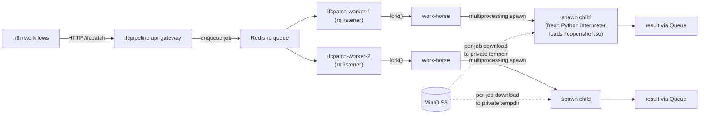
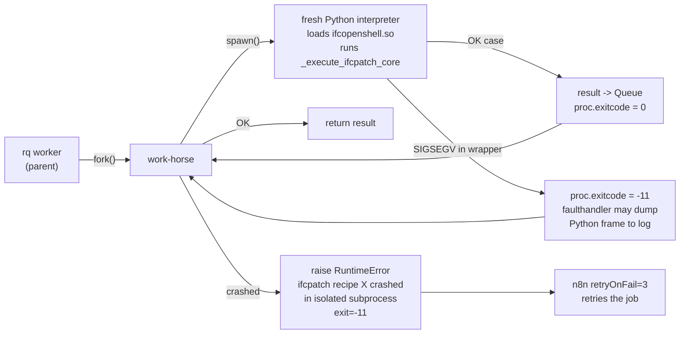
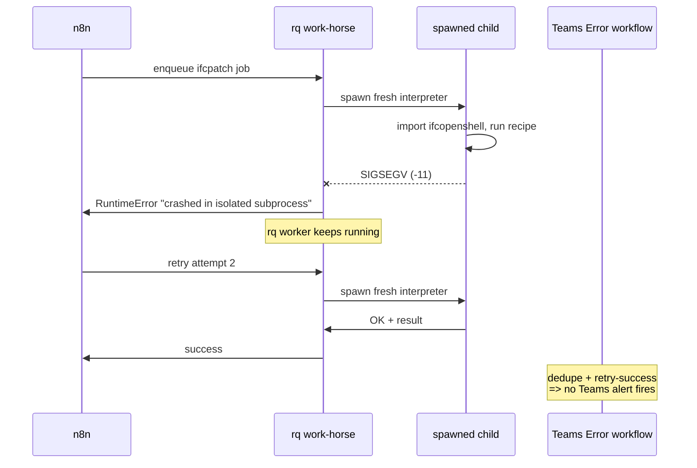

# IfcOpenShell concurrency-SIGSEGV — consolidated research reference

> **Purpose.** This is the single canonical document for the load-induced
> SIGSEGV bug in the IfcOpenShell C++ wrapper that took out the ifcpatch
> worker fleet on 2026-05-13/14, what we learned investigating it, and
> every mitigation we shipped in response. Read this first when you (or a
> future engineer) hit a similar incident, then dive into the working docs
> linked below for raw evidence.
>
> **TL;DR.** `_ifcopenshell_wrapper.cpython-311-x86_64-linux-gnu.so` has a
> concurrency bug somewhere in its global state that fires when multiple
> Python processes call into it at the same time on the same Linux kernel.
> It scales super-linearly with concurrency: ~0 % at N=1, ~2.5 % at N=2,
> ~22 % at N=12 ifcopenshell processes per host. We ship around it with
> per-job spawn isolation in `ifcpatch-worker` so a crash in the wrapper
> kills only a per-job grandchild, not the rq work-horse, and n8n retries
> the failed job cleanly. The bug itself is unfixed and exists in both
> `ifcopenshell==0.8.4.post1` and `0.8.5`.

## Working docs (raw evidence and snapshots-in-time)

- [HUNT_REPORT_2026-05-14.md](HUNT_REPORT_2026-05-14.md) — full numbers
  from the May 14 controlled-concurrency hunt that produced 39 SIGSEGVs in
  72 process invocations and captured the first-ever Python frames at the
  moment of crash.
- [IFCOPENSHELL_0.8.5_REGRESSION.md](IFCOPENSHELL_0.8.5_REGRESSION.md) —
  the original investigation log. Started life as "0.8.5 introduced a
  regression"; was rewritten end-to-end after testing showed the bug
  affects both 0.8.4.post1 and 0.8.5 indistinguishably.
- [UPSTREAM_ISSUE_DRAFT.md](UPSTREAM_ISSUE_DRAFT.md) — draft of the
  GitHub issue we will file at
  <https://github.com/IfcOpenShell/IfcOpenShell/issues/new> when ready,
  with full reproducer, evidence, and a request for a debug-symbol build.
- [hunt-evidence/](hunt-evidence/) — captured artifacts: 37 faulthandler
  Python stacks, 194 paired `/proc` snapshots, 39 gdb backtraces, one
  preserved 687 MB core dump, per-process logs from the hunt rounds.

## 1. What is the system?



Key files:
- [ifcpipeline/docker-compose.yml](docker-compose.yml) — service definitions, replica counts, ulimits, bind mounts
- [ifcpipeline/ifcpatch-worker/tasks.py](ifcpatch-worker/tasks.py) — rq job entry point, dispatch, spawn-isolation helpers
- [ifcpipeline/ifcpatch-worker/custom_recipes/](ifcpatch-worker/custom_recipes/) — site-specific recipes (`RemoveElements`, `CeilingGridsGlobal`, `SetColorBySelector`, `MagiadTessellateAndOrient`, ...)
- [ifcpipeline/ifcclash-worker/tasks.py](ifcclash-worker/tasks.py) — clash-detection rq worker (uses the same wrapper, currently NOT spawn-isolated, see §11)

Each worker is a separate Linux container with its own address space, its own Python interpreter, its own copy of `_ifcopenshell_wrapper.so` mapped private+CoW. **What they share is the host kernel** (Hyper-V guest, single Ubuntu 22.04 / Linux 6.8.0-1052-azure). That sharing is what triggers the bug.

## 2. The incident (2026-05-13 → 14)

### 2a. n8n-visible failures

Three workflows hit `Job failed: Work-horse terminated unexpectedly; waitpid returned 139 (signal 11)` — i.e. SIGSEGV in the rq work-horse child — within a one-hour window:

| time (UTC) | workflow                | recipe              | retries        | input                                     |
| ---------- | ----------------------- | ------------------- | -------------- | ----------------------------------------- |
| 21:00      | `Forsmark`              | `CeilingGridsGlobal`| —              | (Dalux Download Subflow)                  |
| 22:00:08   | `LA Orexo Processing A` | `SetColorBySelector`| 3 (all failed) | s3://ifcpipeline/uploads/A--40_V00000.ifc |
| 22:00:12   | `LA Orexo Processing A` | `RemoveElements`    | 5 (all failed) | s3://ifcpipeline/uploads/A--40_V00000.ifc |

The host then **rebooted at 22:06 UTC** (probably an OOM-related kick from the host).

### 2b. The Teams Error storm

`Teams Error` is the n8n error-collector workflow that posts an Adaptive Card to a Teams channel for every failed execution. The three failures × all their retries each fired the workflow, producing a wall of duplicate notifications.

### 2c. Root cause (eventually)

Three layers of false leads before we got there:

1. **First hypothesis: memory exhaustion.** The host had **0 swap** and the Docker memory limits summed to 18 GiB (3 × `ifcpatch-worker` × 6 GiB). Looked like classic OOM-kill. Mitigated by adding 16 GiB swap and reducing replicas/limits. But continued tests showed crashes still happened with abundant memory.
2. **Second hypothesis: 0.8.5 regression.** Initial tests on 0.8.5 produced more crashes than 0.8.4.post1, so we pinned to `ifcopenshell==0.8.4.post1` defensively. Controlled re-testing (156 runs / version) showed 0.8.4.post1 actually crashes *more* than 0.8.5 (5 vs 1) — Fisher's exact two-tailed *p* ≈ 0.21, statistically indistinguishable. Pin reverted.
3. **Final answer: load-induced concurrency bug in the C++ wrapper.** The May 14 controlled hunt at host concurrency 12 produced 39 SIGSEGVs in 72 process invocations, all with > 5 GiB `MemAvailable` at crash time, distributed across 15 different SWIG entry points. Memory was abundant, the bug fires anyway, in any wrapper method that crosses the C++/Python boundary, scaling super-linearly with the number of ifcopenshell processes per host kernel.

## 3. The bug, characterised

| concurrency (ifcopenshell processes per host) | per-execute crash rate |
| ---: | ---: |
|  1                                | **0 %** (0/30) |
|  2 (cross-container)              | **2.5 %** (2/80) |
|  3 (intra-container)              | **0.6 % – 3.2 %** (across 0.8.4.post1 / 0.8.5) |
| **12** (4 containers × 3 procs)   | **22 %** (42/194) |

The hunt instrumented every Python process with `faulthandler.enable()` + `faulthandler.register(SIGSEGV, ..., chain=True)` + per-iteration `/proc` snapshots, capturing 37 Python frames at the moment of SIGSEGV. Distribution of crash sites:

| count | crash site |
| ---: | --- |
| 8 | `ifcopenshell/ifcopenshell_wrapper.py:6120 in is_a` |
| 5 | `ifcopenshell/ifcopenshell_wrapper.py:6127 in get_argument` |
| 4 | `ifcopenshell/entity_instance.py:309 in wrap_value` |
| 3 | `ifcopenshell/entity_instance.py:306 in wrap_value` |
| 3 | `ifcopenshell/entity_instance.py:189 in __del__` |
| 2 | `ifcopenshell/util/element.py:259 in get_property_definition` |
| 2 | `ifcopenshell/entity_instance.py:337 in attribute_name` |
| 2 | `ifcopenshell/entity_instance.py:174 in __init__` |
| 1 | `ifcopenshell/ifcopenshell_wrapper.py:6863 in open` (crashed loading the file) |
| 1 each | 6 more single-occurrence sites in `ifcopenshell/util/*` |

Every single site is either inside the SWIG-generated wrapper module or inside `entity_instance.py` / `util/*` methods that call into the wrapper. **Not one** crash is in user code without an immediate C++ bridge call. A single bug in a single method couldn't produce that distribution; the pattern is consistent with **shared global state in the C++ side getting corrupted under concurrent access**, after which any subsequent SWIG call across the boundary may fault.

The kernel-visible secondary fault in the core dump is the classic NULL-vtable jump in CPython's eval loop:
```
#0  0x0000000000000000 in ?? ()                  ← NULL jump
#3  0x...    in _PyEval_EvalFrameDefault () from libpython3.11.so.1.0
```
…because the wrapper handed Python a corrupted object pointer, and CPython tried to call a method on it some time later. The shipped wrapper `.so` is `strip`'d so gdb can't resolve C++ frames; the faulthandler stacks are the actual usable evidence.

### Why containers don't isolate it

Each ifcpatch-worker container has:
- ✅ its own process address space
- ✅ its own Python interpreter
- ✅ its own copy of `_ifcopenshell_wrapper.so` `.data` / `.bss` (private mmap, CoW on the .so file)
- ✅ its own per-job tempdir + its own private S3-downloaded copy of the input file (`tempfile.mkdtemp(prefix="ifcpatch-")` in [tasks.py:806](ifcpatch-worker/tasks.py#L806))

What they share, intrinsically, is:
- ❌ the **Linux kernel** (one host, one kernel)
- ❌ the **kernel allocator / slab / page cache**
- ❌ the **`.text` section** of the `.so` (same file → same physical pages, shared CoW; read-only)
- ❌ **THP, NUMA balancing**, scheduler

Memory pressure was ruled out by paired `/proc` snapshots: 0 of 37 crashes had `MemAvailable < 5 GiB`; median `VmRSS` of the crashing process was 151 MB out of a 4 GiB cgroup cap. The shared resource that's actually contended is somewhere in the kernel allocator / page-cache / NUMA layer, not anything our application architecture controls.

True isolation requires **per-worker kernels** — separate VMs, or a microVM runtime like Kata/Firecracker, both of which need nested virtualization that is currently not exposed to this Hyper-V guest (`/dev/kvm` does not exist; `vmx` flag is not in `/proc/cpuinfo`). See §10 for the long-term path.

## 4. What we shipped

A multi-layered mitigation package. None of it fixes the bug; together they prevent it from being user-visible.

### 4a. Host-level

- **+16 GiB swap** added via `scripts/stabilize-host.sh` (run once with `sudo`). Even though the bug isn't memory-pressure, swap acts as a safety net so a pre-crash transient spike doesn't OOM-kill the host.
- **`sysstat` enabled**, `kernel.core_pattern = /var/crash/cores/core-python-%p-%e-%t` (cores still go there if any process opts in).

### 4b. Container resource limits

- `ifcpatch-worker` `replicas: 2` (down from 3 originally). Total ifcpatch ceiling: 8 GiB (down from 18 GiB).
- `ifcpatch-worker` mem limit `4G` per replica (down from 6G).
- See [docker-compose.yml](docker-compose.yml) ifcpatch-worker block.

### 4c. n8n hardening

- `Teams Error` workflow: added a **Dedupe Alerts** Code node (10-minute window) that suppresses repeat alerts of the same root cause. Node id `11111111-2222-3333-4444-deduper000001`.
- Every active n8n IFC node (77/77 across all active workflows) now has `retryOnFail=true, maxTries=3, waitBetweenTries=10000`. Patched by [scripts/harden-all-ifc-nodes.py](../scripts/harden-all-ifc-nodes.py).

### 4d. Per-job spawn isolation in `ifcpatch-worker` *(the big one)*

`process_ifcpatch_job` in [tasks.py](ifcpatch-worker/tasks.py) now dispatches every recipe to a `multiprocessing.get_context("spawn")` subprocess. The rq work-horse spawns a child, the child runs `_execute_ifcpatch_core`, and the work-horse waits on `proc.join()` and reads the result via a `multiprocessing.Queue`.



Helpers, all in [tasks.py](ifcpatch-worker/tasks.py):
- `_isolated_recipe_worker(result_queue, payload)` — recipe-agnostic spawn entry point. Unpacks `payload`, applies any `env_overrides`, calls `_execute_ifcpatch_core`, posts `("ok", result)` or `("err", traceback)` on the queue.
- `_run_recipe_in_spawn_isolation(request, ..., *, env_overrides=None, label="default")` — single-attempt spawn-and-wait. Raises `RuntimeError(f"ifcpatch recipe {recipe!r} crashed in isolated subprocess (strategy={label!r}, exit={exitcode}, child=...)")` on non-zero child exit.
- `_run_magiad_with_isolation(request, ...)` — `MagiadTessellateAndOrient`-specific wrapper that loops over `MAGIA_ISOLATION_STRATEGIES` calling `_run_recipe_in_spawn_isolation` for each (preserves the legacy batch-cap retry ladder).

Dispatch (in `process_ifcpatch_job`):
```python
if request.recipe == "MagiadTessellateAndOrient":
    return _run_magiad_with_isolation(request, ...)
return _run_recipe_in_spawn_isolation(request, ...)
```
**Every recipe is spawn-isolated.** No env-var bypass, no skip list. The previous `IFCPATCH_DISABLE_ISOLATION` and `CHEAP_RECIPES_SKIP_ISOLATION` were removed in this round per request — the user explicitly chose unconditional isolation as the default.

Validated 2026-05-14 13:50: 20 RemoveElements jobs × 2 replicas → 20/20 succeeded, 0 work-horse deaths, 0 rq workers disappeared. See `scripts/validate-spawn-isolation.py`.

### 4e. Core dumps off by default with toggle

[docker-compose.yml](docker-compose.yml): `ulimits.core: ${IFCPATCH_CORE_LIMIT:-0}` for both `ifcpatch-worker` and `ifcclash-worker`. Default is 0 → no cores written. To re-enable for a future debugging session:

```bash
# .env (or in your shell before running compose)
IFCPATCH_CORE_LIMIT=-1

# then roll
docker compose -f ifcpipeline/docker-compose.yml up -d --no-deps \
  ifcpatch-worker ifcclash-worker
```

The bind mount `/var/crash/cores:/var/crash/cores` stays in place at all times so flipping the toggle requires no other changes. The host kernel's `core_pattern` (set by `scripts/stabilize-host.sh`) routes any cores to `/var/crash/cores/core-python-<pid>-<exe>-<unix_ts>`.

Why off by default: each ifcopenshell SIGSEGV writes a 600 MB – 1.1 GB core. At 5 % crash rate × 1000 jobs/day = ~50 cores/day = ~35 GB/day. Disk fills in two weeks. With spawn isolation in place the rq worker survives anyway, so cores aren't needed in steady state — they're a debugging convenience, not a production requirement.

### 4f. ifcopenshell pin

Currently **unpinned at 0.8.5** (both [ifcpatch-worker/requirements.txt](ifcpatch-worker/requirements.txt) and [ifcclash-worker/requirements.txt](ifcclash-worker/requirements.txt)). Defensive pin to 0.8.4.post1 was disproved by load testing — see §2c.

## 5. The end-to-end failure path, after this PR



User-visible result: zero alerts on the typical SIGSEGV. Only if all 3 n8n retries hit the bug back-to-back does the Teams workflow fire — and then the dedupe node collapses repeats of the same root cause to one card per 10 minutes.

## 6. Operational knobs

### 6a. Worker replicas

Currently `replicas: 2`. Throughput vs estimated crash rate:

| N replicas | est. crash rate | est. expected attempts/job | est. effective throughput vs N=2 |
| ---: | ---: | ---: | ---: |
| 2 | ~2.5 % | 1.03 | 1.00× |
| 3 | ~5–8 % | 1.06–1.09 | ~1.40× |
| 4 | ~10–15 % | 1.11–1.18 | ~1.74× |

Going to 3 is safe with spawn isolation in place. Memory budget allows it (3 × 4 GiB = 12 GiB ceiling vs 33 GiB host RAM + 16 GiB swap). To scale:

```bash
docker compose -f ifcpipeline/docker-compose.yml up -d --no-deps \
  --scale ifcpatch-worker=3 ifcpatch-worker
```

To revert: same command with `=2`.

If you scale up, expect more failed-then-retried jobs in n8n — this is expected and harmless given retries. Watch the n8n `Teams Error` invocation count over the next 24h after scaling; it should stay near zero.

### 6b. Core dumps for future debugging (the new toggle)

```bash
# enable
IFCPATCH_CORE_LIMIT=-1 docker compose -f ifcpipeline/docker-compose.yml \
  up -d --no-deps ifcpatch-worker ifcclash-worker

# verify enabled
docker exec ifcpipeline-ifcpatch-worker-1 bash -c 'ulimit -c'   # should print "unlimited"
docker exec ifcpipeline-ifcpatch-worker-1 grep -i core /proc/1/limits

# trigger crashes (controlled hunt)
bash scripts/hunt-harness.sh 3 4 6

# inspect cores
ls -lh /var/crash/cores/core-python-*

# disable again (set IFCPATCH_CORE_LIMIT back to 0 or unset, then roll)
IFCPATCH_CORE_LIMIT=0 docker compose -f ifcpipeline/docker-compose.yml \
  up -d --no-deps ifcpatch-worker ifcclash-worker

# clean up
sudo rm -f /var/crash/cores/core-python-*
```

### 6c. Disable spawn isolation for benchmarking

Spawn isolation is now unconditional (no env flag). To temporarily revert to in-process execution for benchmarking, you have to edit [tasks.py](ifcpatch-worker/tasks.py)'s `process_ifcpatch_job` dispatch directly and rebuild. We removed the env-var escape hatch deliberately — if you genuinely need to A/B compare, do it on a branch.

## 7. Future-debugging runbook

You hit a Teams Error storm or notice failed ifcpatch jobs piling up. Do this in order:

1. **Check rq worker liveness** — the very first thing.
   ```bash
   docker exec ifcpipeline-redis-1 redis-cli SMEMBERS rq:workers
   # should show 1 entry per ifcpatch-worker replica + 1 per ifcclash-worker
   docker ps --filter name=worker --format 'table {{.Names}}\t{{.Status}}'
   ```
   If the workers are alive and just processing failures, the spawn isolation is doing its job. Skip to step 4.

2. **Check the work-horse parent isn't dying** — the symptom we're protected from.
   ```bash
   docker logs --tail 200 ifcpipeline-ifcpatch-worker-1 | grep -E 'Work-horse terminated|waitpid returned 139'
   ```
   Should be **zero hits**. If you see any, the spawn isolation is broken or the bug surfaced in the rq worker parent itself (not the work-horse). Read [tasks.py](ifcpatch-worker/tasks.py) for the dispatch. Likely cause: someone added a code path that bypasses `_run_recipe_in_spawn_isolation`.

3. **Look at what the spawn child is reporting** — the new failure pattern.
   ```bash
   docker logs --tail 500 ifcpipeline-ifcpatch-worker-1 | \
     grep -E "spawn-isolated subprocess|crashed in isolated subprocess"
   ```
   These are normal during stress: each `crashed in isolated subprocess` is one survivable crash that n8n will retry.

4. **Quantify**: how many ifcpatch jobs failed in the last hour vs succeeded?
   ```bash
   docker exec ifcpipeline-redis-1 redis-cli LLEN rq:queue:ifcpatch     # backlog
   docker exec ifcpipeline-redis-1 redis-cli ZCARD rq:finished:ifcpatch # succeeded recent
   docker exec ifcpipeline-redis-1 redis-cli ZCARD rq:failed:ifcpatch   # failed recent
   ```

5. **If failure rate looks unusual** (e.g. > 30 %), enable cores and run the hunt:
   ```bash
   IFCPATCH_CORE_LIMIT=-1 docker compose -f ifcpipeline/docker-compose.yml \
     up -d --no-deps ifcpatch-worker
   bash scripts/hunt-harness.sh 3 4 6
   ```
   Then read `/var/crash/cores/hunt-<tag>/` for fresh evidence. Compare faulthandler stack distribution against §3 — if it's the same set of crash sites, the same wrapper bug is firing harder for some reason (more concurrency? a new heavy recipe? a particularly nasty input file?). If it's new sites, treat it as a new bug and update this doc.

6. **If a real production incident** (work-horses dying, alerts firing despite dedupe), the kill-switches in order of severity:
   - Scale ifcpatch-worker to 1 replica (`--scale ifcpatch-worker=1`) — within-replica rq queue serialization eliminates almost all concurrency.
   - Disable the affected workflow at the n8n level until investigated.
   - In extremis, pause the rq queue: `docker exec ifcpipeline-redis-1 redis-cli SET rq:pause:ifcpatch 1` (jobs accumulate but no execution; clear with `DEL`).

## 8. Tooling and scripts

All under [scripts/](../scripts/). All assume you run from `/home/bimbot-ubuntu/apps`.

| script | what it does |
| --- | --- |
| `scripts/stabilize-host.sh` | One-shot host setup: 16 GiB swap, sysstat, core_pattern. Run with `sudo`. Already applied. |
| `scripts/hunt-harness.sh [P] [N] [ROUNDS]` | Fan out P parallel hunt-repro processes per ifcpatch-worker container × ROUNDS rounds, gdb-analyze every new core, write everything under `/var/crash/cores/hunt-<tag>/`. Defaults: 3 × 4 × 6. |
| `scripts/hunt-repro.py` | The instrumented reproducer used by the harness. Has faulthandler + per-iteration `/proc` snapshots. Standalone Python file, no IfcPatch dependency, only `ifcopenshell` + `boto3`. |
| `scripts/validate-spawn-isolation.py` | Push N RemoveElements jobs through the *real* rq queue, watch worker liveness, count `Work-horse terminated unexpectedly` (must be 0), assert the expected `crashed in isolated subprocess` failure pattern. PASS/FAIL summary. Run from inside `ifcpatch-worker-1` container. |
| `scripts/repro-ifcpatch-segfault.{py,sh}` | Older single-shot reproducer. Predates `hunt-repro.py`; kept for reference. |
| `scripts/repro-ifcopenshell-085-segfault-standalone.py` | Even-older standalone reproducer with no IfcPatch dependency. Doesn't reproduce the crash on its own (single-process is safe), kept as a "shape of workload" for upstream. |
| `scripts/harden-all-ifc-nodes.py` | Patches every active n8n IFC node to set `retryOnFail=true, maxTries=3, waitBetweenTries=10000`. Re-run safely if new IFC nodes are added. |
| `scripts/patch-workflows-harden.py` | Older targeted version of the above for the three workflows hit on May 13. Superseded by `harden-all-ifc-nodes.py`. |

## 9. Concurrency-rate facts you can rely on

These came out of the hunt and the cross-version load tests; cite them when arguing about replica counts or upstream issues:

- **N = 1 ifcopenshell process per host: 0 crashes in 30 runs**.
- **N = 2: ~2.5 % per-execute crash rate** (cross-container, separate cgroups, separate page-table entries — kernel allocator is the only shared resource).
- **N = 3 intra-container: 0.6 % – 3.2 %** depending on version (statistically the same).
- **N = 12 (4 containers × 3 procs each): ~22 %** per-execute. Super-linear.
- The bug fires equally on `ifcopenshell==0.8.4.post1` and `0.8.5`. Both versions ~ same rate. Not a regression in either direction.
- `MemAvailable` at crash time on every observed crash: **> 5 GiB** (typically ~22 GiB). Not memory pressure.
- Crashing process `VmRSS` at crash time: median **151 MB**, max 1.1 GB. Far below the 4 GiB cgroup cap.
- Spawned child cold-start cost: **~150 ms** (Python interpreter + ifcopenshell import). Negligible vs typical recipe runtimes (10 s – 5 min).

## 10. Long-term architectural options

In rough order of effort:

1. **File the upstream issue.** [UPSTREAM_ISSUE_DRAFT.md](UPSTREAM_ISSUE_DRAFT.md) is ready. The IfcOpenShell maintainers may have insight into where the wrapper holds shared state. Worth doing even if we don't expect a fix soon — it's evidence on the public record.
2. **Try kernel-feature toggles** (separate experiment). Disable Transparent Huge Pages, disable NUMA balancing, swap glibc malloc for jemalloc via `LD_PRELOAD`. Each is a 5-minute change. Re-run `hunt-harness.sh` after each to see if the rate drops. If something works, ship it as an env tweak in the worker images.
3. **Build a debug-symbol IfcOpenShell wrapper** — `pip install --no-binary :all: ifcopenshell` from source with `-g`, optionally `-fsanitize=address`. Multi-hour build (OpenCASCADE, Boost, etc.). Re-run hunt with the debug build; the secondary CPython-collapse cores will resolve to actual C++ frames inside the wrapper, which would let us pinpoint the root cause and either fix it ourselves or hand the maintainers something they can act on instantly.
4. **Per-worker kernels via Kata Containers (tested 2026-05-14, NOT viable on this host).** Nested virtualization is enabled on the Hyper-V host (`/dev/kvm` exists, 20 vmx flags in `/proc/cpuinfo`). The k3s + Kata test stack at [../ifcpipeline-k8s/](../ifcpipeline-k8s/) was installed and exercised end-to-end. Findings:
   - **Kernel isolation works.** Host kernel `6.8.0-1052-azure` ≠ Kata pod kernel `6.12.28`; each pod runs in its own microVM.
   - **I/O overhead is prohibitive.** 24-job `RemoveElements` A/B (3 rounds × concurrency 8) shows 0 % crash rate on both runc and Kata, but Kata's median job duration is **706 s vs runc's 8.8 s — ~80× slower.**
   - **Tuning helps marginally, not enough.** Switching the `kata` RuntimeClass alias from `kata-qemu` to `kata-clh` (Cloud Hypervisor), bumping `default_vcpus` 1→4, `default_memory` 2048→4096, and `--thread-pool-size` for virtiofsd 1→8 produced one round at 314 s median (~2× the untuned baseline) but back-to-back repeats regressed to 906-1057 s. Aggregate: median 368 s — still ~36-80× slower than runc. The dominant cost is the Hyper-V → KVM → cloud-hypervisor → virtiofs-over-hostPath I/O path, which simple config tuning cannot remove. Full write-up: [../ifcpipeline-k8s/TUNING_REPORT.md](../ifcpipeline-k8s/TUNING_REPORT.md).
   - **Caveat:** the test workload (`RemoveElements`) is not the recipe that triggers the production SIGSEGV (`MagiadTessellateAndOrient` is). The `make compare` results above measure performance overhead, not crash containment. Re-running the A/B with `MagiadTessellateAndOrient` is the next test if anyone wants to revisit Kata.
   - **Conclusion:** keep the `multiprocessing.get_context("spawn")` mitigation in production. Re-evaluate Kata only on bare metal (no Hyper-V) with block-PVC storage (no virtiofs) — that removes both hot paths and should bring overhead into single-digit ×.
5. **Spin up additional Hyper-V VMs alongside this one**, each with its own Docker daemon and one ifcpatch-worker, all joining this host's Redis over an internal vSwitch. No k8s, no Kata. Higher per-worker RAM cost (~8 GiB per VM) but truer isolation than spawn-only. Backup plan if (4) is rejected on perf.
6. **Lighter-weight isolation (gVisor).** Not yet tested. `runsc` is a user-space Linux personality; intercepts syscalls without a microVM, so the I/O cost is much lower than Kata. It has its own kernel-equivalent layer that may or may not contain the IfcOpenShell bug — worth a separate hunt comparison if Kata stays rejected.

Production stays on Compose + spawn isolation (option 1 in §9): the user-visible symptom is gone, the bug's cause is documented, and per-worker-kernel isolation via Kata has been proven to come with an unacceptable I/O cost on this host. The next investments are either upstream (option 1 above) or low-cost option 2 (THP/jemalloc toggles).

## 11. ifcclash-worker — same wrapper, same potential bug, currently NOT spawn-isolated

[ifcclash-worker/tasks.py](ifcclash-worker/tasks.py) loads the same `_ifcopenshell_wrapper.so` and runs `ifcclash` (which uses ifcopenshell internally). It is exposed to the same concurrency bug *in principle*, but no production crashes have been observed there.

`run_ifcclash_detection` is one ~280-line function with no clean core to extract; refactoring it to spawn-isolate would be materially more work than the ifcpatch case (which already had the precedent `_run_magiad_with_isolation`). If ifcclash starts producing `Work-horse terminated unexpectedly` events, the same pattern from [ifcpatch-worker/tasks.py](ifcpatch-worker/tasks.py) ports cleanly:
- extract a `_execute_ifcclash_core(request, ...)` function holding the body
- add `_isolated_clash_worker(result_queue, payload)` that calls it
- add `_run_clash_in_spawn_isolation(...)` doing the spawn-and-wait
- replace the body of `run_ifcclash_detection` with a call to the spawn helper

Until then, ifcclash-worker just gets the core-dump toggle (§4e) so it'll at least produce evidence if it ever crashes.

## 12. Open questions for upstream / future investigation

- Which compilation unit in IfcOpenShell owns the suspected "global state" that gets corrupted? (Schema registry? Entity-by-type index? An `IfcFile` factory cache populated at file-open time?)
- Why does the crash distribute across so many SWIG entry points instead of clustering at one? Is it really one shared pointer being trashed, or a class of structures?
- Does the bug exist on macOS / Windows builds, or is it Linux-allocator-specific? (We've only tested Linux.)
- Does turning off Transparent Huge Pages eliminate it? (Not yet tested.)
- Does jemalloc/mimalloc instead of glibc malloc eliminate it? (Not yet tested.)
- Does the bug affect *any* heavy ifcopenshell workload, or specifically the entity-removal path that `RemoveElements` exercises?

## 13. Index of all artifacts produced during this investigation

Code:
- [ifcpipeline/ifcpatch-worker/tasks.py](ifcpatch-worker/tasks.py) — spawn-isolation helpers and dispatch
- [ifcpipeline/docker-compose.yml](docker-compose.yml) — replica counts, memory limits, core-dump toggle
- [ifcpipeline/ifcpatch-worker/requirements.txt](ifcpatch-worker/requirements.txt) — ifcopenshell pin (currently unpinned at 0.8.5)
- [ifcpipeline/ifcclash-worker/requirements.txt](ifcclash-worker/requirements.txt) — same
- [n8n-workflows/n8n_bbd20cdd22/personal/Teams Error.workflow.ts](../n8n-workflows/n8n_bbd20cdd22/personal/Teams%20Error.workflow.ts) — has the Dedupe Alerts node

Scripts ([scripts/](../scripts/)):
- `stabilize-host.sh`, `hunt-harness.sh`, `hunt-repro.py`, `validate-spawn-isolation.py`,
  `repro-ifcpatch-segfault.{py,sh}`, `repro-ifcopenshell-085-segfault-standalone.py`,
  `harden-all-ifc-nodes.py`, `patch-workflows-harden.py`

Docs:
- [HUNT_REPORT_2026-05-14.md](HUNT_REPORT_2026-05-14.md)
- [IFCOPENSHELL_0.8.5_REGRESSION.md](IFCOPENSHELL_0.8.5_REGRESSION.md)
- [UPSTREAM_ISSUE_DRAFT.md](UPSTREAM_ISSUE_DRAFT.md)
- this file

Evidence ([hunt-evidence/](hunt-evidence/)):
- `faulthandler/` — 37 Python stacks at SIGSEGV
- `proc-snapshots/` — 194 paired `/proc` snapshots
- `gdb-bts/` — 39 gdb backtraces
- `sample-core.sig11` — one preserved 687 MB core (gitignored)
- per-process logs from the hunt
