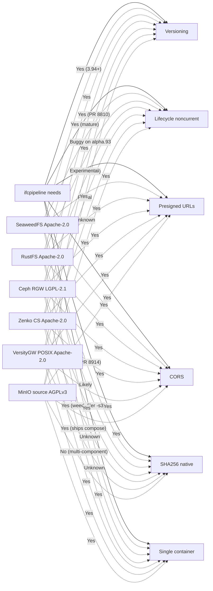

# Object storage alternatives — research report

Companion to [OBJECT_STORAGE.md](OBJECT_STORAGE.md). That document describes
**what** ifcpipeline does with MinIO; this one is the evaluation of **whether
something else should hold the bytes** now that MinIO Community Edition has
effectively been retired upstream.

> **TL;DR** — Stick with MinIO source-build short-term, pilot **SeaweedFS** as
> the migration target, and treat **RustFS** as the "exciting upside" pilot
> once it leaves alpha and the non-current-lifecycle bug closes. **Garage —
> the most popular MinIO replacement in 2025–2026 — is disqualified for this
> pipeline because it does not implement S3 bucket versioning**, and the entire
> audit / lineage / GUID-index / version-pin design in
> [OBJECT_STORAGE.md](OBJECT_STORAGE.md) keys off `VersionId`.

---

## 1. What ifcpipeline actually requires from the S3 backend

Pulled from [OBJECT_STORAGE.md](OBJECT_STORAGE.md),
[shared/object_storage.py](shared/object_storage.py), and
[docker-compose.yml](docker-compose.yml). Any replacement has to clear this
parity bar:

| Capability | Where it's used | Hard / soft |
| --- | --- | --- |
| `boto3` SigV4, **path-style** addressing | [shared/object_storage.py](shared/object_storage.py) (`addressing_style: "path"`, `signature_version="s3v4"`) | Hard |
| **Bucket versioning** — every PUT returns a unique `VersionId` | `object_versions.version_id`, `/audit/history`, `/lineage?version_id=…`, auto-pin at enqueue, GUID index | **Hard** |
| **Presigned GET** signed against a *public* endpoint host | `S3_PUBLIC_ENDPOINT_URL` + separate boto3 client in [shared/object_storage.py](shared/object_storage.py) (`_get_presign_client`) | Hard |
| **CORS** configuration on the bucket | IFC viewer browser fetch following the 307 from `/download/{token}` | Hard |
| **Lifecycle / `NoncurrentVersionExpiration`** | `mc ilm add --expire-noncurrent-days 90` in [OBJECT_STORAGE.md](OBJECT_STORAGE.md) "Lifecycle & retention" | Soft (manual `mc rm --versions` works) |
| **Native** `x-amz-checksum-sha256` (S3 additional checksums) | `S3_CHECKSUM_MODE=native` path in [shared/object_storage.py](shared/object_storage.py). **Default is `app`** in [docker-compose.yml](docker-compose.yml), so app-side hashing on any backend works. | Soft |
| **Single Docker container** | Compose stack binds `127.0.0.1:9000/9001` — loopback only | Soft (multi-component is acceptable but expensive) |
| **`mc` (or equivalent) admin CLI** | Bucket creation + version enable in the `minio-setup` one-shot | Soft (any S3 admin tool covers it) |

The non-negotiable line is: **S3 + versioning + presigned + CORS + single
container**. Everything else has a graceful fallback already in the codebase.

---

## 2. Why this evaluation exists — MinIO CE timeline

| Date | Change | Source |
| --- | --- | --- |
| May 2025 | Admin / management UI removed from the Community Edition console; only the object browser remained | Blocks & Files; `minio/minio#21317` |
| Oct 2025 | Public Docker images and binary releases stopped | `dev.to "MinIO CE in 2026"` |
| Dec 2025 | Public messaging shifted to "maintenance mode" | same |
| Feb 2026 | Repository archived (first time) | same |
| Apr 2026 | Repository archived again and stayed locked | same |

The license itself is unchanged — the server source is still AGPLv3 — but the
operational reality is: **no community binaries, every CVE becomes our build
pipeline, and tooling that assumed public images quietly breaks.** For an
internal pipeline that turns into a slow-burn maintenance tax.

`OpenMaxIO`, the community fork that emerged in 2025, addressed only the
**console UI** and went dormant within four months. It is not a server fork
and does not change anything operationally.

---

## 3. Candidate landscape

### 3.0 Eliminated up front

- **Garage** (AGPL-3.0, Deuxfleurs, Rust) — operational sweet spot for
  self-hosting on small / mixed-ARM hardware, but `GetBucketVersioning`
  is a stub that always returns "versioning not enabled" per the official
  S3 compatibility page (`garagehq.deuxfleurs.fr/reference_manual/s3_compatibility.html`).
  Without bucket versioning, every consumer of `version_id` in the codebase
  becomes a no-op: auto-pin, `/audit/history`, `/lineage?version_id=…`, GUID
  index roles tied to specific versions, lifecycle of non-current versions.
  Disqualified for this pipeline only — for a non-versioned workload Garage
  is genuinely good.

- **OpenMaxIO** — fork of MinIO's *console UI*, not the server. Dormant.
  Doesn't address the supply-chain problem.

### 3.1 SeaweedFS — primary recommendation (Apache 2.0, Go)

- **Versioning**: implemented in v3.94 along with object lock (GOVERNANCE
  and COMPLIANCE retention modes), Legal Hold, and WORM. Production-grade,
  not experimental.
- **Lifecycle on non-current versions**: `NoncurrentVersionExpiration`
  with both `NoncurrentDays` and `NewerNoncurrentVersions` shipped in
  `seaweedfs/seaweedfs#8810`. PR `#8823` explicitly "skip TTL fast-path for
  versioned buckets" so policies actually apply to keys in versioned
  buckets — this is the failure mode we'd actually hit.
- **Additional-checksum SHA-256**: `seaweedfs/seaweedfs#8914` (2026) adds
  `x-amz-checksum-sha256` round-tripping on PUT / HEAD / GET. That makes
  `S3_CHECKSUM_MODE=native` viable post-migration without changing any
  caller-side code.
- **CORS**: bucket-level via `PutBucketCors` *and* a process-level
  `-s3.allowedOrigins` switch.
- **Single-container ergonomics**: `weed server -filer -s3 -s3.config=...`
  starts master + volume + filer + S3 gateway in one process. Maps cleanly
  to one compose service.
- **License**: Apache 2.0 — fully permissive for commercial use.
- **Maturity**: ~32k GitHub stars, v4.x line throughout 2026, active maintainer,
  large contributor base.
- **Risks / friction**:
  - More moving parts than MinIO under the hood (master + volume + filer +
    s3). In single-container mode you don't see it, but if anything goes
    wrong you debug four subsystems instead of one.
  - Helm chart story is mixed (irrelevant for compose-only deployments).
  - Multi-DC replication is more involved to configure than Garage's
    (irrelevant for a single host).

### 3.2 RustFS — pilot / "feel of MinIO" candidate (Apache 2.0, Rust)

- **Versioning**: implemented with delete markers and point-in-time
  recovery (`docs.rustfs.com/features/versioning`). Note that the docs
  state versioning "requires erasure coding and at least four disks" — in
  Docker terms that means four volume mounts. Verify the single-node mode
  doesn't gate versioning behind a multi-disk setup before piloting.
- **Lifecycle**: `rustfs/rustfs#1625` added expiry + tiering transitions
  in Jan 2026, **but `rustfs/rustfs#2512` (Apr 2026) reports
  `NoncurrentVersionExpiration` still doesn't actually delete on `alpha.93`**.
  Manual cleanup until the issue closes.
- **Docker compose**: shipped in-tree at
  [github.com/rustfs/rustfs/blob/main/docker-compose.yml](https://github.com/rustfs/rustfs/blob/main/docker-compose.yml).
  Same `9000` / `9001` port layout as MinIO — drop-in for the existing
  reverse-proxy / Cloudflare tunnel setup.
- **License**: Apache 2.0, ~26k stars.
- **UX**: console UI is the closest analogue to MinIO's old admin UI of
  anything in this list — the practical reason RustFS gets attention.
- **Risks / friction**:
  - Project is `1.0.0-alpha.x`. **Not** stable.
  - Three security advisories in 2026, all patched at `alpha.79`:
    - `CVE-2026-22043` / `GHSA-xgr5-qc6w-vcg9` — IAM `deny_only`
      short-circuit allowed a restricted service account to self-issue
      an unrestricted one.
    - `CVE-2026-22042` / `GHSA-vcwh-pff9-64cc` — `ImportIam` checked
      the wrong action; export-only principals could write IAM state.
    - `GHSA-r54g-49rx-98cr` — access key, secret key, and session token
      logged in plaintext at `log_level: info`. Patched, but the
      mitigation is set `log_level: warn` regardless.
  - The audit code in [shared/object_storage.py](shared/object_storage.py)
    assumes `VersionId` is opaque and string-typed. RustFS satisfies that,
    but the format differs from MinIO's so any downstream consumer that
    *parses* the ID (none today, AFAICT) would break.

### 3.3 Ceph RGW — enterprise escape valve (LGPL-2.1)

- Fully featured: versioning, lifecycle, object lock, bucket replication,
  multi-tenant IAM, KMS integration. Battle-tested at petabyte scale.
- **Wrong shape for the current deployment**: requires `mon` + `osd`
  (≥3 for redundancy in production) + `rgw`. Memory and operational
  overhead are materially higher than any other entry in this report.
- Only consider this if there is an independent reason to move ifcpipeline
  off a single host. Otherwise it's overkill.

### 3.4 Zenko CloudServer — Apache 2.0 fallback (Node.js, Scality)

- Versioning supported with a structured `VersionId` (timestamp +
  replication-group id + sequence id) per the public architecture docs.
- Single-container Docker image (`zenko/cloudserver`). Backends include
  `file` (persistent local) and `mem` (testing).
- License: Apache 2.0.
- **Concerns**:
  - Public release cadence has slowed; the readthedocs site still tops out
    at 7.0.0. The project isn't dead, but momentum is well behind
    SeaweedFS / RustFS.
  - Node.js stack — fine functionally, but a different operational profile
    (memory baseline, gc tuning) than Go/Rust alternatives.
- Acceptable fallback if SeaweedFS pilot fails for reasons that *would
  also disqualify* RustFS.

### 3.5 VersityGW (POSIX backend) — skip until versioning is GA (Apache 2.0, Go)

- Architecturally appealing: turns a local directory into S3. On-disk
  layout stays human-readable and `rsync`-friendly. Useful for migrations
  where you want both filesystem *and* S3 access during the transition.
- **Versioning is explicitly experimental** (`POSIX-versioning` wiki):
  requires a separate `--versioning-dir` shadow tree, the filesystem must
  support extended attributes, and `versity/versitygw#841` documents
  internal errors ("no such file or directory" on xattr writes) under
  concurrent versioned PUTs to the same key.
- ifcpipeline overwrites `uploads/<filename>` *constantly* (every new
  upload of a model with the same name), which is exactly the failure
  mode reported in `#841`.
- Promising long-term, not safe today.

### 3.6 MinIO source-build (AGPLv3) — explicit "stay" option

- The server source is still AGPLv3 and the codebase still works. You
  build the container image from a pinned tag, mirror it internally, and
  carry on.
- Pragmatic short-term play if the migration cost outweighs the
  supply-chain risk for the next 6–12 months. Pair it with:
  - An internal mirror of the last good `quay.io/minio/minio` digest so
    today's pull works tomorrow regardless of registry policy.
  - A documented build pipeline (`docker build`-from-source-tag) so CVEs
    can be patched without external dependencies.
- This is the "do nothing yet" baseline against which the pilots are
  measured.

---

## 4. Feature-parity matrix

| Capability | MinIO source-build | **SeaweedFS** | **RustFS** | Ceph RGW | Zenko CS | VersityGW POSIX | Garage |
| --- | --- | --- | --- | --- | --- | --- | --- |
| License | AGPLv3 | Apache 2.0 | Apache 2.0 | LGPL-2.1 | Apache 2.0 | Apache 2.0 | AGPL-3.0 |
| `boto3` SigV4 path-style | ✅ | ✅ | ✅ | ✅ | ✅ | ✅ | ✅ |
| **Bucket versioning** | ✅ | ✅ (≥3.94) | ✅ | ✅ | ✅ | ⚠ experimental | ❌ stub |
| Lifecycle: noncurrent expiry | ✅ | ✅ (PR #8810) | ⚠ buggy on `alpha.93` (#2512) | ✅ | ⚠ partial | ⚠ unknown | ✅ |
| Presigned GET (public endpoint) | ✅ | ✅ | ✅ | ✅ | ✅ | ✅ | ✅ |
| Bucket CORS | ✅ | ✅ | ✅ | ✅ | ✅ | ✅ | ✅ |
| Native `x-amz-checksum-sha256` | ✅ | ✅ (PR #8914) | ⚠ likely / unverified | ✅ | ⚠ unverified | ⚠ unverified | ⚠ unverified |
| Single-container deploy | ✅ | ✅ (`weed server -filer -s3`) | ✅ (ships compose) | ❌ multi-component | ✅ | ✅ | ✅ |
| Stable release status | ⚠ archived | ✅ | ❌ alpha | ✅ | ✅ (slow) | ✅ | ✅ |
| Recent security incidents | n/a | none of note | 3× 2026 (patched ≥`alpha.79`) | n/a | n/a | n/a | n/a |

Legend: ✅ supported, ⚠ partial / caveat, ❌ missing / disqualifying.



---

## 5. Recommendation

- **Status quo (months 0–3): MinIO source-build.** Pin to a known-good tag,
  mirror the image internally, document the build steps. This buys time
  to pilot a replacement without operational pressure.
- **Primary pilot (months 1–4): SeaweedFS.** Apache 2.0, has every feature
  ifcpipeline relies on (including the non-current expiration and
  additional-checksum SHA-256 PRs merged in 2026), single-process startup
  that drops into the existing compose stack, active maintainer community.
  Lowest-risk path to a stable Apache-licensed backend.
- **Secondary pilot (parallel, non-prod only): RustFS.** Run on a throwaway
  dataset to evaluate the operator experience and console UX. Pin to
  `>= alpha.79`, set `log_level=warn`, watch `rustfs/rustfs#2512` for the
  non-current-lifecycle fix. **Do not promote to production until the
  project leaves alpha and that issue closes.**
- **Skip for now:** Garage (no versioning, disqualified), VersityGW
  (versioning experimental + matches our overwrite pattern in the bug
  report), Zenko (works but slower momentum than SeaweedFS), OpenMaxIO
  (UI fork, dormant).
- **Reconsider Ceph RGW** only if ifcpipeline is independently moving off
  a single Docker host — its overhead is not worth eating just for the
  storage layer.

---

## 6. Non-destructive evaluation playbook

The codebase already has a clean feature flag (`USE_OBJECT_STORAGE`) and a
boto3-only client. That means swapping backends is a compose-and-env-vars
exercise; no application changes are required.

### 6.1 Spin up the candidate alongside MinIO

1. Add an alternate compose file at `docker-compose.<candidate>.yml`
   (e.g. `docker-compose.seaweedfs.yml`) that **only** replaces the
   `minio` and `minio-setup` services. Keep the rest of the stack
   identical.
2. Bind to a different loopback port pair (e.g. `127.0.0.1:9100/9101`)
   so the OG MinIO can keep running. Or bring MinIO down first if disk
   pressure is a concern.
3. Mirror the same env contract for the candidate's admin tools:
   - `S3_ACCESS_KEY` / `S3_SECRET_KEY` → candidate's root credentials
   - `S3_BUCKET=ifcpipeline`
   - Region `us-east-1` (any S3 backend ignores this in practice)

### 6.2 Point a smoke profile at the candidate

In `.env.<candidate>` (or via `--env-file`):

```env
S3_ENDPOINT_URL=http://<candidate>:9000
S3_PUBLIC_ENDPOINT_URL=http://localhost:9100
S3_ACCESS_KEY=<candidate root user>
S3_SECRET_KEY=<candidate root password>
S3_CHECKSUM_MODE=app   # keep app-side hashing for the first run
GUID_INDEX_MODE=async
```

Then bring up the test stack:

```bash
docker compose \
  -f docker-compose.yml \
  -f docker-compose.<candidate>.yml \
  --env-file .env.<candidate> \
  up -d --build
```

### 6.3 Run the existing smoke test

[`./smoke-test.sh`](smoke-test.sh) already exercises every worker end to
end. Run it against the candidate stack and **assert all of**:

- All eight worker jobs succeed (csv, tester, convert, diff, qto, 2json,
  patch, clash — the last two have the known library-level soft failures
  documented in [OBJECT_STORAGE.md](OBJECT_STORAGE.md)).
- `GET /audit/history/uploads/Building-Architecture.ifc` returns at least
  one row with a non-null `version_id`.
- `GET /lineage/output/csv/arch.csv?version_id=<vid>` resolves and the
  `ancestors` array includes the original upload.
- Re-uploading `uploads/Building-Architecture.ifc` produces a **different**
  `VersionId` than the first upload, and `/audit/history/...` now lists
  both rows newest-first.
- The candidate's equivalent of
  `mc ilm add --expire-noncurrent-days 1 local/ifcpipeline` is accepted.
  Wait one scheduler tick, confirm the prior non-current version is
  reaped, then confirm `GET /audit/history/...` still lists the row (the
  Postgres trail is intentionally durable beyond the bytes).
- `GET /guid/<some_guid>` returns rows pinned to the candidate's
  `version_id`s after `GUID_INDEX_MODE=async`.

### 6.4 Compare against MinIO

Capture wall-clock for the full smoke against both stacks:

| Run | MinIO baseline | Candidate | Δ |
| --- | --- | --- | --- |
| Upload throughput (`smoke-test.sh` seed phase) | | | |
| End-to-end wall-clock | | | |
| Steady-state RSS of the storage container | | | |
| Steady-state CPU during smoke | | | |

A regression of more than ~25 % on any of those is a signal to dig deeper
before cutover.

### 6.5 Only after a green smoke

- Flip `S3_CHECKSUM_MODE=native` and rerun. Verify
  `head_metadata(...)["sha256"]` returns the expected hex digest. This
  exercises the candidate's `x-amz-checksum-sha256` support.
- Configure CORS on the candidate's bucket the same way you did for MinIO
  and verify the IFC viewer can fetch a presigned URL cross-origin.
- Put a Cloudflare tunnel / reverse proxy in front of the candidate's
  port and verify SigV4 still validates with the public hostname (the
  signature covers `Host`; this is why we have `S3_PUBLIC_ENDPOINT_URL`).

### 6.6 Migration of existing data

> **Operational runbook:** phased local validation, production deploy, and
> offline cutover are documented in
> [SEAWEEDFS_CUTOVER.md](SEAWEEDFS_CUTOVER.md).

Once the candidate is the chosen target:

1. Bring the candidate up alongside MinIO with both populated.
2. Use `mc mirror` (or `aws s3 sync`) to copy
   `s3://minio/ifcpipeline → s3://candidate/ifcpipeline`. Do this in a
   read-only window if there are concurrent writers.
3. Run a final incremental sync, flip
   `S3_ENDPOINT_URL` / `S3_PUBLIC_ENDPOINT_URL` to point at the
   candidate, restart the gateway and workers.
4. Keep MinIO read-only for at least one week as the rollback artifact.
   Decommission only after a clean burn-in.

Important: the audit trail in Postgres carries the **old** `version_id`
values from MinIO. After migration, those IDs no longer resolve on the
candidate. Either:

- Accept the historical IDs as opaque audit records (the
  `object_versions` rows still tell the story; the bytes for old
  non-current versions may not be retrievable on the new backend), or
- Run a one-shot script that re-PUTs each historical version against the
  new backend and rewrites `object_versions.version_id` accordingly.

The simpler option is the first one — the audit chain stays intact, only
the ability to `download_file(VersionId=<old>)` of pre-migration non-current
versions is lost.

---

## 7. Decision log

If/when one of these is picked, capture the rationale here so the next
person doesn't re-litigate:

- _Backend selected_: _TBD_
- _Date_: _TBD_
- _Why this one over the runner-up_: _TBD_
- _What we accept losing vs. MinIO_: _TBD_
- _Rollback artifact_: _TBD_

---

## 8. References

- [OBJECT_STORAGE.md](OBJECT_STORAGE.md) — current MinIO integration in this repo.
- MinIO CE status (2026): `dev.to/rosgluk/minio-ce-in-2026-retired-upstream-source-only-and-what-to-use-1k02`.
- Console removal (2025): `blocksandfiles.com/2025/06/19/minio-users-complain-after-admin-ui-removed-from-community-edition/`; `minio/minio#21317`.
- Garage S3 compatibility: `garagehq.deuxfleurs.fr/reference_manual/s3_compatibility.html`.
- SeaweedFS S3 versioning: release notes for v3.94.
- SeaweedFS non-current lifecycle: `seaweedfs/seaweedfs#8810`, `#8823`.
- SeaweedFS additional checksums: `seaweedfs/seaweedfs#8914`.
- SeaweedFS S3 CORS: `seaweedfs/seaweedfs` wiki, `S3-CORS`.
- RustFS versioning: `docs.rustfs.com/features/versioning`.
- RustFS lifecycle bug on `alpha.93`: `rustfs/rustfs#2512`; lifecycle fix PR `#1625`.
- RustFS security advisories: `GHSA-xgr5-qc6w-vcg9`, `GHSA-vcwh-pff9-64cc`, `GHSA-r54g-49rx-98cr`.
- VersityGW POSIX versioning: wiki `POSIX-Backend` and `POSIX-versioning`; concurrency bug `versity/versitygw#841`.
- Zenko CloudServer architecture: `s3-server.readthedocs.io/en/latest/ARCHITECTURE.html`.
