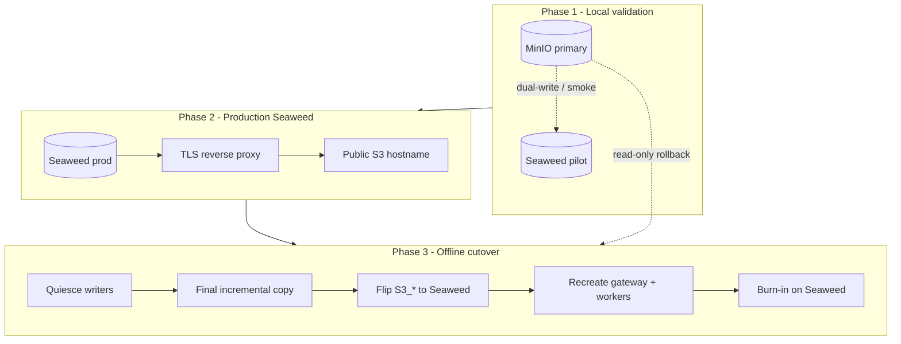
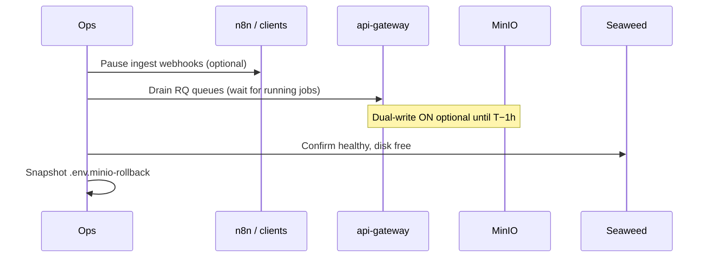

# SeaweedFS cutover — migration runbook

Companion documents:

| Doc | Role |
| --- | --- |
| [OBJECT_STORAGE.md](OBJECT_STORAGE.md) | How ifcpipeline uses S3 today (MinIO) |
| [OBJECT_STORAGE_ALTERNATIVES.md](OBJECT_STORAGE_ALTERNATIVES.md) | Why SeaweedFS was chosen |
| [SEAWEEDFS_PILOT.md](SEAWEEDFS_PILOT.md) | Dual-write pilot, parity monitor, kill switch |
| [docker-compose.seaweedfs.yml](docker-compose.seaweedfs.yml) | SeaweedFS sidecar stack (pilot) |
| [seaweedfs/s3.json](seaweedfs/s3.json) | S3 identities for Seaweed |

> **Intent** — Prove SeaweedFS **locally** (Phase 1), stand up **production**
> Seaweed (Phase 2), then perform an **offline maintenance-window cutover**
> (Phase 3). MinIO stays available read-only for rollback until burn-in ends.
>
> This runbook **does not** require 100% `mc mirror` parity before cutover.
> It requires confidence in the **write/read paths** you will use in production
> and a controlled final copy of business-critical prefixes.

Official deploy reference (Enterprise licensing, admin UI):  
https://seaweedfs.com/docs/deploy/

This stack uses the **open-source** image (`chrislusf/seaweedfs`) unless you
explicitly adopt Enterprise (>25 TB or supported admin/OIDC).

---

## Overview



| Phase | Traffic | Data on Seaweed | MinIO |
| --- | --- | --- | --- |
| **1 — Local pilot** | All reads/writes → MinIO | Shadow / partial backfill | Source of truth |
| **2 — Prod deploy** | Still MinIO (or staging only) | Empty or staging copy | Source of truth |
| **3 — Cutover window** | Flip to Seaweed | Final sync + all new writes | Read-only snapshot |
| **4 — Burn-in** | Seaweed only | Live | Read-only, then decommission |

---

## GO / NO-GO before scheduling Phase 3

All must be true (or explicitly accepted in the decision log at the bottom).

| Gate | How to verify |
| --- | --- |
| Daily smoke on Seaweed | `parity-reports/smoke-latest.json` → `"level": "ok"` |
| Versioning + lifecycle | Smoke steps show overwrite + non-current reap on `parity_test/` |
| Presigned downloads | `S3_PUBLIC_ENDPOINT_URL` against Seaweed (via tunnel/proxy) returns 200 |
| CORS | IFC viewer loads object via presigned URL |
| Large upload path | Gateway/worker PUT of multi‑hundred‑MiB IFC succeeds on Seaweed (boto3 single-part up to 5 GiB threshold in `shared/object_storage.py`) |
| Production topology sized | Disk ≥ MinIO used + headroom; memory/CPU limits reviewed |
| Rollback rehearsed | Staging flip MinIO ← env file + recreate |
| Stakeholders notified | Maintenance window + n8n queue drain |

**Known pilot limitations (do not block cutover if plan accounts for them):**

- Bulk `mc mirror` is poor for objects **> ~5 MiB** (multipart copy) and can
  stress a single-node volume server — use **final boto3 copy** in Phase 3, not
  a full-speed mirror. See [SEAWEEDFS_PILOT.md](SEAWEEDFS_PILOT.md) §9.
- Historical Postgres `version_id` values remain MinIO UUIDs after cutover
  (see §Version IDs below).

---

## Phase 1 — Local validation (pilot)

**Goal:** Same S3 contract as MinIO on a dev/sidecar Seaweed instance. No
production traffic switch.

### 1.1 Stack

```bash
cd /home/bimbot-ubuntu/apps/ifcpipeline

docker compose \
  -f docker-compose.yml \
  -f docker-compose.seaweedfs.yml \
  --profile seaweedfs-pilot \
  up -d seaweedfs seaweedfs-setup parity-monitor daily-smoke
```

Optional dual-write (see [SEAWEEDFS_PILOT.md](SEAWEEDFS_PILOT.md) §2.3): set
`S3_SHADOW_*` in `.env`, **rebuild** images, recreate gateway + workers **with
both compose files**.

### 1.2 Exit criteria

- [ ] `curl -s -o /dev/null -w '%{http_code}\n' http://127.0.0.1:8333/` → `403`
      (auth required — expected)
- [ ] `smoke-latest.json` → `level: ok` for 3 consecutive days
- [ ] Manual upload + presigned GET + one worker output on shadow (if dual-write on)
- [ ] Document pinned image tag (e.g. `chrislusf/seaweedfs:4.25`) in decision log

### 1.3 Pilot teardown (before Phase 2 prod)

Pilot-only services can stay for staging; for a clean prod deploy either:

- Use a **new** `seaweedfs-data` volume on the target host, or
- Wipe pilot volume only after exporting anything you need for forensics.

Do **not** copy a corrupted pilot volume to production.

---

## Phase 2 — Production Seaweed deploy

**Goal:** SeaweedFS ready to receive a full bucket copy; **MinIO still serves
production** until Phase 3.

### 2.1 Topology

| Deployment | When | Compose pattern |
| --- | --- | --- |
| **Single host** (current) | One Docker host, &lt; ~10 TB | `weed server -filer -s3` (same as pilot), pinned image |
| **Scaled** (later) | HA / multi-TB growth | Split `master`, `volume`, `filer`, S3 gateway per [SeaweedFS docs](https://seaweedfs.com/docs/deploy/) |

Minimum production hardening vs pilot:

| Item | Pilot | Production |
| --- | --- | --- |
| Image tag | `latest` | **Pinned** semver |
| Memory limit | 1 GiB | **2 GiB+** (tune from smoke + copy tests) |
| Upload throttle | N/A for live path | Final copy: **low concurrency** |
| `s3.json` secrets | Placeholder | **Rotated** keys; match `.env` |
| S3 API exposure | `127.0.0.1:8333` | **TLS** at reverse proxy; in-cluster `http://seaweedfs:8333` |
| Enterprise license | N/A | Only if total data **≥ 25 TB** |

### 2.2 Bucket bootstrap

Mirror `seaweedfs-setup` behaviour:

- Bucket `ifcpipeline` (or `S3_BUCKET`)
- **Versioning enabled**
- Lifecycle: non-current expiry aligned with MinIO policy (global or per-prefix)
- CORS rule equivalent to MinIO (for viewer)

### 2.3 Staging rehearsal (strongly recommended)

1. Clone `.env` → `.env.seaweed-staging` with:
   - `S3_ENDPOINT_URL=http://seaweedfs:8333`
   - `S3_PUBLIC_ENDPOINT_URL=<staging-public-host>`
   - `S3_SHADOW_*` **empty**
2. Point **one** non-prod gateway + workers at staging env; run `smoke-test.sh`
   or manual IFC upload/clash job.
3. Practice **rollback** (§Rollback) on staging.

### 2.4 Exit criteria

- [ ] Seaweed prod/staging healthy 72 h
- [ ] Presign + CORS verified on **public** hostname
- [ ] Disk allocation signed off
- [ ] Runbook owner + rollback contact assigned
- [ ] Phase 3 window scheduled (duration estimate below)

---

## Phase 3 — Offline cutover (maintenance window)

**Goal:** Move **traffic and authoritative bytes** to Seaweed in one controlled
window. “Offline” = **quiesce writers**, final copy, env flip, verify — not
air-gapped operation forever.

### 3.1 Suggested window length

| Bucket size | Writers | Typical window |
| --- | --- | --- |
| &lt; 500 GiB | Stopped | 2–4 h |
| 500 GiB – 2 TiB | Stopped | 4–8 h |
| &gt; 2 TiB | Stopped | Plan per-prefix copy + next-day verification |

Add buffer for large `uploads/*.ifc` (boto3 PUT, not parallel storm).

### 3.2 Pre-window (T−24 h → T−0)



Checklist:

- [ ] Export `.env` as `.env.minio-rollback` (all `S3_*` and `S3_SHADOW_*`)
- [ ] `docker compose exec postgres pg_dump …` (audit DB — optional but wise)
- [ ] Note MinIO object count + size: `mc du local/ifcpipeline`
- [ ] Announce window; pause n8n triggers that upload IFCs
- [ ] Wait for RQ queues empty: `http://localhost:9181` or `rq info`

### 3.3 Window execution (T0 → Tend)

#### Step A — Quiesce writes

- [ ] Stop or block new uploads at gateway (maintenance flag / firewall / stop
      n8n workflows).
- [ ] Confirm no running worker jobs writing to `output/`.

#### Step B — Final incremental copy

**Do not** run full-speed `mc mirror` as the only strategy.

Preferred order:

1. **If dual-write was on for ≥48 h:** run diff-only backfill for
   `only_in_primary` keys (boto3 GET MinIO → PUT Seaweed, concurrency 1–2).
2. **Otherwise:** prefix-ordered copy:
   - `uploads/` (required)
   - `output/` (required for active projects)
   - `cache/clash-tess/` (optional — regenerates on clash)

Copy tool requirements:

- Use same `TransferConfig(multipart_threshold=5 GiB)` as
  `shared/object_storage.py` (avoids fragile 5 MiB multipart **copy**).
- Retry with backoff; log failures to `parity-reports/cutover-copy.json`.
- Throttle large files; pause 10–30 s between &gt;200 MiB objects if Seaweed
  restarts under load.

Acceptance for Step B:

- [ ] `uploads/` — 100% of keys required for active projects present on Seaweed
- [ ] Spot-check 5 largest IFCs: size + etag match MinIO HEAD
- [ ] `mc diff local/ifcpipeline seaweed/ifcpipeline` — only acceptable gaps
      documented (e.g. skipped cache)

#### Step C — Flip environment

Edit `.env` (production):

```env
# --- before (MinIO) ---
# S3_ENDPOINT_URL=http://minio:9000
# S3_PUBLIC_ENDPOINT_URL=https://minio-api.byggstyrning.se

# --- after (Seaweed) ---
S3_ENDPOINT_URL=http://seaweedfs:8333
S3_PUBLIC_ENDPOINT_URL=https://s3-api.byggstyrning.se   # example — your public host

# Disable dual-write / pilot shadow
S3_SHADOW_ENDPOINT_URL=
S3_SHADOW_ACCESS_KEY=
S3_SHADOW_SECRET_KEY=
```

Ensure `S3_ACCESS_KEY` / `S3_SECRET_KEY` match [seaweedfs/s3.json](seaweedfs/s3.json)
(or IAM equivalent on Enterprise).

#### Step D — Recreate application tier

**Always** use both compose files when your stack still defines MinIO in the
base file and Seaweed in the override:

```bash
cd /home/bimbot-ubuntu/apps/ifcpipeline

docker compose \
  -f docker-compose.yml \
  -f docker-compose.seaweedfs.yml \
  up -d --force-recreate \
    api-gateway \
    ifccsv-worker ifctester-worker ifcconvert-worker \
    ifcclash-worker ifcdiff-worker ifc5d-worker \
    ifc2json-worker ifcpatch-worker guid-index-worker
```

Verify shadow is **off** and primary is Seaweed:

```bash
docker compose exec api-gateway env | grep -E '^S3_ENDPOINT|^S3_SHADOW'
# Expect: S3_ENDPOINT_URL=http://seaweedfs:8333
# Expect: S3_SHADOW_ENDPOINT_URL=  (empty)
```

Later cleanup (post burn-in): promote Seaweed into `docker-compose.yml` as the
only object store and drop MinIO services — separate change, not required for
cutover night.

#### Step E — MinIO read-only rollback mode

Do **not** delete MinIO data in the window.

```bash
# Example: revoke write policy or stop writers only touching MinIO
# Keep container up for mc stat / rollback GET
```

Record MinIO endpoint and credentials in `.env.minio-rollback`.

#### Step F — Smoke tests (before opening traffic)

| # | Test | Pass |
| --- | --- | --- |
| 1 | `POST /upload/ifc` small sample | New row in `object_versions` with Seaweed `version_id` |
| 2 | Presigned download URL in browser | 200, correct bytes |
| 3 | One worker job (e.g. ifctester) | Output in `output/…` on Seaweed only |
| 4 | `GET /audit/history/…` | Lists recent rows |
| 5 | IFC viewer fetch | CORS OK |
| 6 | Optional: `S3_CHECKSUM_MODE=native` | `head_metadata` sha256 matches |

- [ ] Re-enable n8n / client traffic
- [ ] Monitor gateway logs 30 min for S3 errors

### 3.4 Exit criteria (end of window)

- [ ] All Step F tests pass
- [ ] No sustained 5xx on upload/download endpoints
- [ ] Ops sign-off recorded in decision log

---

## Phase 4 — Burn-in and decommission

**Duration:** minimum **7 days** (match original pilot week).

| Day | Action |
| --- | --- |
| 1–3 | Watch error rates; disk growth; Seaweed restarts |
| 3–7 | Spot-audit random `object_versions` — new `version_id` format on Seaweed |
| 7 | Run [scripts/seaweedfs-weekly-summary.py](scripts/seaweedfs-weekly-summary.py) adapted for post-cutover metrics |
| 7+ | If green: stop `parity-monitor` MinIO sidecar or whole pilot profile |

Decommission MinIO (only after burn-in):

- [ ] Final archive or snapshot of MinIO volume (compliance)
- [ ] Remove `minio` / `minio-setup` from compose or stop containers
- [ ] Remove `.env.minio-rollback` from active use (keep in vault)
- [ ] Update [README.md](README.md) object-storage section

---

## Version IDs and audit trail

Postgres `object_versions.version_id` pins lineage to **MinIO UUIDs** today.

After cutover:

| Concern | Policy |
| --- | --- |
| New uploads | Seaweed `version_id` stored as today |
| Historical rows | Keep as-is; treat old `version_id` as **opaque audit metadata** |
| `download_file(VersionId=…)` for old rows | May **404** on Seaweed — acceptable if documented |
| Full historical byte replay on new backend | Requires re-PUT + DB rewrite — **out of scope** unless compliance mandates |

Document the chosen policy in the decision log.

---

## Rollback (during burn-in)

**When:** Seaweed corruption, sustained upload failure, presign breakage.

```bash
cd /home/bimbot-ubuntu/apps/ifcpipeline
cp .env.minio-rollback .env

docker compose \
  -f docker-compose.yml \
  -f docker-compose.seaweedfs.yml \
  up -d --force-recreate \
    api-gateway \
    ifccsv-worker ifctester-worker ifcconvert-worker \
    ifcclash-worker ifcdiff-worker ifc5d-worker \
    ifc2json-worker ifcpatch-worker guid-index-worker
```

**Requires:** MinIO unchanged since pre-cutover snapshot; no new writes you
need to merge back. Writes during Seaweed burn-in after rollback are **only**
on MinIO unless you re-sync.

---

## Environment reference

| Variable | Phase 1–2 (MinIO live) | Phase 3+ (Seaweed live) |
| --- | --- | --- |
| `S3_ENDPOINT_URL` | `http://minio:9000` | `http://seaweedfs:8333` |
| `S3_PUBLIC_ENDPOINT_URL` | MinIO public host | Seaweed public host |
| `S3_ACCESS_KEY` / `S3_SECRET_KEY` | MinIO creds | Seaweed creds (`s3.json`) |
| `S3_SHADOW_ENDPOINT_URL` | `http://seaweedfs:8333` (optional) | **empty** |
| `USE_OBJECT_STORAGE` | `true` | `true` |
| `S3_CHECKSUM_MODE` | `app` (default) | `app`, then `native` after smoke |

---

## Compose and profiles after cutover

| Profile / file | After cutover |
| --- | --- |
| `docker-compose.seaweedfs.yml` | Keep while Seaweed defined here; merge into main file when stable |
| `--profile seaweedfs-pilot` | Drop `parity-monitor` MinIO diff or entire profile |
| `minio`, `minio-setup` | Stop after burn-in |
| `seaweedfs`, `seaweedfs-setup` | **Always on** |

---

## Decision log

Fill when Phase 3 is scheduled or completed.

| Field | Value |
| --- | --- |
| **Backend** | SeaweedFS OSS / Enterprise (circle one) |
| **Image tag** | e.g. `chrislusf/seaweedfs:4.25` |
| **Cutover date (planned)** | |
| **Cutover date (actual)** | |
| **Window length** | |
| **Final copy method** | e.g. boto3 per-key / dual-write + diff |
| **Version ID policy** | opaque history / rewrite (circle one) |
| **Prefixes skipped** | e.g. `cache/clash-tess/` |
| **Public S3 URL** | |
| **Rollback used?** | yes / no |
| **Sign-off** | |

---

## Related commands (quick reference)

```bash
# Seaweed health (loopback)
curl -s -o /dev/null -w 'HTTP %{http_code}\n' http://127.0.0.1:8333/

# Parity (pilot only — MinIO vs Seaweed)
cat parity-reports/parity-latest.json | python3 -m json.tool | head -40

# Object counts (both backends)
# see SEAWEEDFS_PILOT.md §2.4 and cutover Step B

# Kill dual-write without touching MinIO primary
# S3_SHADOW_ENDPOINT_URL=  + recreate gateway/workers
```

---

## FAQ

**Can we cut over before local pilot is perfect?**  
No — Phase 1 gates exist to avoid debugging Seaweed and migration under
production pressure.

**Can we move “offline” after local works, on a different server?**  
Yes. Phase 2 deploys prod Seaweed (often empty). Phase 3 copies bytes over the
network during the window; you do not migrate by copying Docker volumes from
laptop to server.

**Do we need Enterprise?**  
Not below ~25 TB. See https://seaweedfs.com/docs/deploy/

**What about the dual-write pilot?**  
Useful for Phase 1 confidence; **disable** at cutover (`S3_SHADOW_*` empty).
Optional: leave dual-write on until T−1 h to shrink final copy scope.
