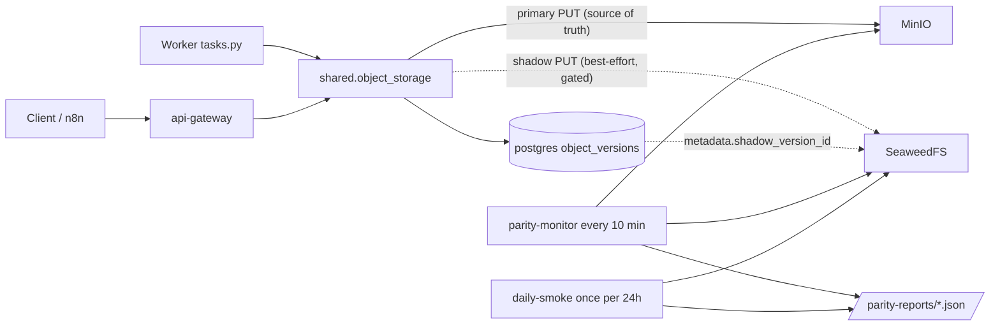

# SeaweedFS dual-write pilot — operational runbook

Companion to [OBJECT_STORAGE.md](OBJECT_STORAGE.md) (current MinIO setup),
[OBJECT_STORAGE_ALTERNATIVES.md](OBJECT_STORAGE_ALTERNATIVES.md) (why
SeaweedFS in the first place), and [SEAWEEDFS_CUTOVER.md](SEAWEEDFS_CUTOVER.md)
(Phase 1–4 migration and offline cutover runbook).

> **Goal**: run SeaweedFS alongside MinIO for **one week**. Every successful
> PUT mirrors to SeaweedFS on a best-effort basis. A parity monitor diffs
> the two backends every 10 minutes; a daily smoke exercises versioning +
> non-current lifecycle. At the end of the week a single script produces a
> verdict report.

> **Production safety**: shadow writes are wrapped in `try / except` and
> never raise. MinIO is the source of truth for reads, presigned URLs,
> audit `version_id`, and lifecycle. Worst case if SeaweedFS misbehaves:
> log spam + counter file climbing — flip `S3_SHADOW_ENDPOINT_URL=` empty
> and recreate the production services, dual-write goes inert.

---

## 1. What gets deployed



New files & services introduced by this pilot:

| Path | Purpose |
| --- | --- |
| [docker-compose.seaweedfs.yml](docker-compose.seaweedfs.yml) | Override file: SeaweedFS server, setup, initial-sync, parity-monitor, daily-smoke + shadow env passthrough on api-gateway & every worker. All gated by `--profile seaweedfs-pilot`. |
| [seaweedfs/s3.json](seaweedfs/s3.json) | SeaweedFS S3 identity config (one `admin` user matching `S3_SHADOW_ACCESS_KEY` / `S3_SHADOW_SECRET_KEY`). Bind-mounted read-only into the seaweedfs container. |
| [parity-monitor/](parity-monitor/) | Container image (Python 3.12 + boto3 + psycopg) running `parity_check.py` (long-running) or `daily_smoke.py` (long-running, once-per-24h). |
| [scripts/seaweedfs-initial-sync.sh](scripts/seaweedfs-initial-sync.sh) | One-shot `mc mirror` from MinIO into SeaweedFS at bring-up. Writes `parity-reports/initial-sync.json`. |
| [scripts/seaweedfs-weekly-summary.py](scripts/seaweedfs-weekly-summary.py) | Day-7 aggregator. Produces `parity-reports/SEAWEEDFS_PILOT_REPORT.md` with a `GO / NO-GO / EXTEND_PILOT` verdict. |
| [shared/object_storage.py](shared/object_storage.py) | Adds `_shadow_client`, `_shadow_put_from_path`, `_shadow_put_fileobj`, `_record_shadow_metric`, and integrates them into `upload_from_path` / `upload_fileobj_and_hash` / `upload_and_audit`. All gated by `S3_SHADOW_ENDPOINT_URL`. |
| [api-gateway/api-gateway.py](api-gateway/api-gateway.py) | Two upload sites now forward `shadow_version_id` etc. into `audit_db.record_upload(metadata=...)`. |

Nothing in [docker-compose.yml](docker-compose.yml) changes.

---

## 2. Day-0 bring-up

### 2.1 Populate `.env`

Append the block from [`.env.example`](.env.example) and **change the
secret key from the placeholder**. The values must match
[seaweedfs/s3.json](seaweedfs/s3.json):

```env
S3_SHADOW_ENDPOINT_URL=http://seaweedfs:8333
S3_SHADOW_ACCESS_KEY=seaweedfs-pilot
S3_SHADOW_SECRET_KEY=change-me-to-a-secure-password   # <-- rotate this AND seaweedfs/s3.json
S3_SHADOW_BUCKET=ifcpipeline
S3_SHADOW_REGION=us-east-1
```

If you change `S3_SHADOW_SECRET_KEY` in `.env`, also change the
`secretKey` field in [seaweedfs/s3.json](seaweedfs/s3.json) (and recreate
the `seaweedfs` service: `docker compose -f docker-compose.yml -f
docker-compose.seaweedfs.yml --profile seaweedfs-pilot up -d
--force-recreate seaweedfs seaweedfs-setup`).

### 2.2 Bring up the pilot stack

```bash
cd /home/bimbot-ubuntu/apps/ifcpipeline

docker compose \
  -f docker-compose.yml \
  -f docker-compose.seaweedfs.yml \
  --profile seaweedfs-pilot \
  up -d --build
```

This brings up SeaweedFS, runs the setup container, runs the initial-sync
one-shot, and starts parity-monitor + daily-smoke. **Production services
still talk MinIO-only at this point** because:

1. The shadow env vars on api-gateway / workers were added by the
   override file but they need a `--force-recreate` to be picked up, **and**
2. The dual-write **code** in `shared/object_storage.py` is only in the
   image after a `docker compose build`. A bare `--force-recreate`
   without a rebuild brings up new containers from the **old** image and
   silently keeps writing single-backend; the gateway log will show
   `PUT s3://… (streaming, app sha256)` instead of
   `(streaming, dualwrite, …)`.

### 2.3 Rebuild + recreate production services to turn dual-write ON

```bash
# 1. Rebuild every image that has shared/object_storage.py in it.
#    --parallel cuts this from ~10 min to ~80 s on a warm cache.
docker compose \
  -f docker-compose.yml \
  -f docker-compose.seaweedfs.yml \
  build --parallel \
    api-gateway \
    ifccsv-worker \
    ifctester-worker \
    ifcconvert-worker \
    ifcclash-worker \
    ifcdiff-worker \
    ifc5d-worker \
    ifc2json-worker \
    ifcpatch-worker \
    guid-index-worker

# 2. Recreate so containers run the freshly-built image + new env.
docker compose \
  -f docker-compose.yml \
  -f docker-compose.seaweedfs.yml \
  up -d --force-recreate \
    api-gateway \
    ifccsv-worker \
    ifctester-worker \
    ifcconvert-worker \
    ifcclash-worker \
    ifcdiff-worker \
    ifc5d-worker \
    ifc2json-worker \
    ifcpatch-worker \
    guid-index-worker
```

(`--profile seaweedfs-pilot` is **not** required for this step — only the
new pilot services need the profile flag. Production services live in
the main compose and the override just adds env + a `/reports` mount.)

The override file pins `build.network: host` on every rebuilt service
because the default docker-bridge on this host has no usable DNS, so
`pip install` fails inside the BuildKit network. Confirm by tailing one
worker after recreate:

```bash
docker compose -f docker-compose.yml -f docker-compose.seaweedfs.yml \
  logs --tail=30 ifctester-worker | grep -E 'shadow|dualwrite'
# expect: shadow.metric outcome=success op=put_from_path elapsed_ms=…
```

### 2.4 Confirm bring-up

```bash
# 1. Initial sync result — should show matching object counts.
cat parity-reports/initial-sync.json

# 2. SeaweedFS health.
curl -s http://localhost:8333/status | head -c 200

# 3. First parity tick (wait ~10 min after recreate, or restart the
#    parity-monitor service to force one immediately).
docker compose -f docker-compose.yml -f docker-compose.seaweedfs.yml \
  logs --tail=20 parity-monitor
cat parity-reports/parity-latest.json | python3 -m json.tool | head -50

# 4. Force one upload through the gateway, then check the audit row:
curl -s -F "file=@shared/examples/Building-Architecture.ifc" \
  -H "X-API-Key: ${IFC_PIPELINE_API_KEY}" \
  http://localhost:8000/upload/ifc

docker compose exec -T postgres \
  psql -U ifcpipeline -d ifcpipeline -c \
  "SELECT object_key, version_id, metadata->>'shadow_version_id' AS shadow_vid
     FROM object_versions
    WHERE object_key='uploads/Building-Architecture.ifc'
    ORDER BY created_at DESC LIMIT 1;"
```

The `shadow_vid` column **must** be non-null for new uploads. If it's null
on a freshly-uploaded object, the dual-write didn't activate. Two things
to check, in order:

1. **Env**: `docker compose exec api-gateway env | grep S3_SHADOW`. If
   the vars are empty, fix `.env` and recreate.
2. **Image content**: tail the gateway log during a fresh upload — a
   working container logs `PUT s3://… (streaming, dualwrite, app
   sha256=… size=…)`. If you instead see `(streaming, app sha256)` (no
   `dualwrite`), the container is on the **old image** and you skipped
   step 1 in §2.3. Re-run `docker compose … build api-gateway && up -d
   --force-recreate api-gateway`.

---

## 3. Daily checks (day 1–6)

One paragraph each morning is enough.

### 3.1 Parity loop is alive

```bash
ls -lt parity-reports/parity-*.json | head -3
docker compose -f docker-compose.yml -f docker-compose.seaweedfs.yml \
  logs --tail=2 parity-monitor
```

You should see a fresh `parity-*.json` no older than `PARITY_INTERVAL_S`
(default 10 minutes). Last log line should look like:

```
parity level=ok primary=1234 shadow=1234 only_primary=0 only_shadow=0 sampled=20 matched=20 audit_checked=18 audit_mismatched=0
```

### 3.2 Shadow PUT rate

```bash
python3 -c "import json; d=json.load(open('parity-reports/shadow-counter.json')); s=d.get('success',0); f=d.get('failure',0); t=s+f; print(f'success={s} failure={f} rate={(s/t*100) if t else 0:.3f}%')"
```

Anything below **99.9 %** for a full hour is the mid-week tripwire (§4).

### 3.3 Daily smoke

```bash
cat parity-reports/smoke-latest.json | python3 -m json.tool | head -30
```

`level` must be `ok`. Any `warn`/`error` means SeaweedFS missed either
the versioning step or the lifecycle reap — open the file and check the
`steps.*` blocks.

### 3.4 Audit cross-check

The parity report's `audit.mismatched` list must stay empty. If a
mismatch appears, drill into the specific key:

```bash
jq '.audit' parity-reports/parity-latest.json
```

A mismatch where `shadow_db_version_id=NULL but shadow HEAD has
version_id=...` means a row was inserted before dual-write was enabled
(this is fine for pre-pilot data) — confirm by `created_at` in postgres.
A mismatch where both DB and HEAD have values but they differ is a real
defect.

---

## 4. Mid-week tripwire — kill switch

If at any point during the week:

- shadow failure rate climbs above **0.1 %**, **or**
- the parity loop emits `level=error` more than two consecutive ticks, **or**
- a daily smoke flags `lifecycle_reaped: false`, **or**
- you observe **any** production write latency regression you can pin to
  the dual-write path (check api-gateway logs for `shadow upload_*
  failed`),

flip the kill switch:

```bash
# Edit .env: set S3_SHADOW_ENDPOINT_URL to empty.
sed -i 's|^S3_SHADOW_ENDPOINT_URL=.*|S3_SHADOW_ENDPOINT_URL=|' .env

# Recreate so the new (empty) value lands in the running containers.
docker compose \
  -f docker-compose.yml \
  -f docker-compose.seaweedfs.yml \
  up -d --force-recreate \
    api-gateway \
    ifccsv-worker ifctester-worker ifcconvert-worker ifcclash-worker \
    ifcdiff-worker ifc5d-worker ifc2json-worker ifcpatch-worker \
    guid-index-worker
```

The dual-write path goes inert at the first `_shadow_enabled()` check.
You can leave the SeaweedFS + parity-monitor + daily-smoke services
running (they're harmless), or stop them:

```bash
docker compose \
  -f docker-compose.yml \
  -f docker-compose.seaweedfs.yml \
  --profile seaweedfs-pilot \
  down
```

This keeps the `seaweedfs-data` volume so a later resumption is cheap.
Add `-v` to wipe it.

---

## 5. Day-7 weekly summary

```bash
docker compose \
  -f docker-compose.yml \
  -f docker-compose.seaweedfs.yml \
  --profile seaweedfs-pilot \
  run --rm parity-monitor \
  python /scripts/seaweedfs-weekly-summary.py \
    --reports-dir /reports \
    --out /reports/SEAWEEDFS_PILOT_REPORT.md
```

Read `parity-reports/SEAWEEDFS_PILOT_REPORT.md`. Headline verdict at the
top: `GO` / `NO-GO` / `EXTEND_PILOT`.

### 5.1 GO criteria (all must hold)

| Criterion | Threshold | Source |
| --- | --- | --- |
| Shadow PUT success rate | >= 99.9 % | `shadow-counter.json` aggregated by summary |
| Object-count drift | No sustained drift across 2 consecutive ticks | parity reports |
| Sampled sha256 / size drift | 0 across every parity tick | parity reports `samples[].size_match` / `checksum_match` |
| Audit cross-check mismatches | 0 over the full week | parity reports `audit.mismatched` |
| Daily smoke | `level=ok` every day | smoke reports |
| Lifecycle (NoncurrentVersionExpiration) | Reaped every day within `SMOKE_LIFECYCLE_WAIT_S` | `smoke.*.steps.lifecycle_reap.reaped` |
| Parity-loop crashes (`level=error`) | 0 | parity reports |

### 5.2 Outcome paths

- **GO**: open a follow-up plan for cutover (swap `S3_ENDPOINT_URL` to
  SeaweedFS, migrate historical objects, decommission MinIO).
- **EXTEND_PILOT**: re-run the soak for another 3–7 days, fix whatever
  the summary flagged, then re-evaluate.
- **NO-GO**: flip the kill switch in §4, document the failure mode in
  this file (§7), and revisit either MinIO source-build or RustFS per
  [OBJECT_STORAGE_ALTERNATIVES.md](OBJECT_STORAGE_ALTERNATIVES.md).

---

## 6. Rollback (full teardown)

```bash
# 1. Disable dual-write on production services.
sed -i 's|^S3_SHADOW_ENDPOINT_URL=.*|S3_SHADOW_ENDPOINT_URL=|' .env
docker compose -f docker-compose.yml -f docker-compose.seaweedfs.yml \
  up -d --force-recreate \
    api-gateway ifccsv-worker ifctester-worker ifcconvert-worker \
    ifcclash-worker ifcdiff-worker ifc5d-worker ifc2json-worker \
    ifcpatch-worker guid-index-worker

# 2. Stop SeaweedFS + monitors. The seaweedfs-data volume survives.
docker compose -f docker-compose.yml -f docker-compose.seaweedfs.yml \
  --profile seaweedfs-pilot down

# 3. (Optional) wipe SeaweedFS state. Destructive.
docker volume rm ifcpipeline_seaweedfs-data
```

Audit rows in postgres are kept on purpose — the
`metadata->>'shadow_version_id'` entries are historic evidence and don't
hurt anything when the shadow backend is gone.

---

## 7. Decision log

Fill in after the pilot.

- **Day-0 bring-up date**: _TBD_
- **Day-7 verdict**: _TBD (`GO` / `NO-GO` / `EXTEND_PILOT`)_
- **Observed shadow PUT success rate**: _TBD_
- **Observed lifecycle behaviour**: _TBD_
- **Any sustained drift**: _TBD_
- **Production write-latency regression seen?**: _TBD_
- **Next action**: _TBD_

---

## 8. Tunables (`.env`)

All optional; defaults are sensible.

| Variable | Default | Effect |
| --- | --- | --- |
| `PARITY_INTERVAL_S` | `600` | Seconds between parity ticks. Lower = more reports, higher CPU. |
| `PARITY_SAMPLE_N` | `20` | Number of shared keys to HEAD-sample per tick. |
| `PARITY_MAX_LIST` | `50000` | Cap on listed keys per backend per tick. |
| `SMOKE_INTERVAL_S` | `86400` | Seconds between daily-smoke runs. |
| `SMOKE_LIFECYCLE_WAIT_S` | `1800` | Max time to wait for non-current expiration to reap v1. |
| `SMOKE_LIFECYCLE_POLL_S` | `60` | Poll interval inside the smoke's wait loop. |

---

## 9. Known caveats observed during bring-up

These were surfaced during the day-0 setup of this pilot; if you see them
during your own bring-up, that's expected.

### 9.1 Volume-server SIGSEGV under PUT burst

`chrislusf/seaweedfs:4.25` (current `latest` at pilot start) has been
observed to **crash and restart** its single-process volume server when
`mc mirror` hammers it at 100 + MiB/s. The crash is preceded by a
`volumeDataIntegrityChecking failed data file /data/ifcpipeline_<N>.dat
actual <X> bytes expected <Y> bytes` line; on restart the affected volume
is marked **read-only** (`volume <N> are not all writable`), which surfaces
to clients as transient `connection refused` on PUTs that route to that
volume.

[scripts/seaweedfs-initial-sync.sh](scripts/seaweedfs-initial-sync.sh)
mitigates this with `mc mirror --limit-upload 50MiB` (override via
`MIRROR_LIMIT_MBPS`) and up to 5 retries. The dual-write hot path
naturally serializes at production write rate (well under 10 PUT/s in
typical operation), so this does not affect steady-state behaviour.

### 9.2 Multipart-upload mirror failures

`mc mirror` triggers S3 **multipart copy** for any object larger than its
multipart threshold (5 MiB by default). SeaweedFS 4.25 has been observed
to drop multipart copies for the largest objects in the bucket; on a
3.35 GiB / 3 800-object source bucket the converged state was
~91 % object count, with **all unmirrored objects > 5 MiB** (e.g. an
84 MiB `Pipe.obj`, a 155 MiB `Sprinkler.obj`). This shows up in the parity
report as a stable `only_in_primary` set of multipart-sized keys.

This is a **finding for the GO/NO-GO decision**, not a bug in this pilot:
if the production read path ever falls back to SeaweedFS, those large
objects would 404. The follow-up cutover plan must either resolve this
upstream (track [chrislusf/seaweedfs](https://github.com/chrislusf/seaweedfs)
issues), switch to a different SeaweedFS major version, or route large
multipart objects to a different backend.

The forward dual-write path uses standard `s3.upload_fileobj` (no
multipart copy semantics — boto3 streams in via `PutObject` /
`UploadPart`), so the daily smoke and live ingest will surface this same
failure mode independently if it bites.

---

## 10. FAQ

**Q: Why not `mc mirror --watch` instead of application-layer dual-write?**
`mc mirror --watch` writes a separate process between the two backends.
It's good for periodic backfill (we use it for the initial sync) but a
poor parity signal: a missed event in `mc` looks identical to a missed
event in production. Application-layer dual-write proves the real write
path works against SeaweedFS, which is what the pilot is trying to find
out.

**Q: Why doesn't the shadow read path also get exercised?**
On purpose, this iteration: reads (`download_to_tempfile`, presigned URLs,
`/download/{token}`) stay MinIO-only so production users never see a
SeaweedFS error. Reads are exercised separately by the daily smoke against
the side `parity_test/` prefix. After a GO verdict, the cutover plan
swaps reads in one motion (separate followup, separate plan).

**Q: Will the spool in `upload_fileobj_and_hash` slow down uploads?**
`SpooledTemporaryFile(max_size=64 << 20)` keeps anything under 64 MiB in
RAM. For larger uploads it spills to disk in the gateway container's tmp.
The net cost is one extra memcpy on the hot path; in practice it's not
measurable against the boto3 network time. If you do see a regression in
api-gateway latency, the kill switch in §4 takes it out.

**Q: SeaweedFS supports anonymous access too — why bother with `s3.json`?**
A pilot worth running has the same auth model as production. Anonymous
mode would silently accept the dual-write path even if real SigV4 was
broken; we want to *find* problems, not mask them.
