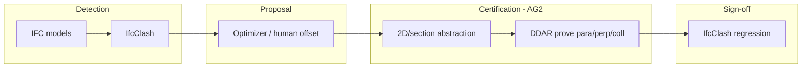

# AEC clash × AlphaGeometry: capability guide (from scenario matrix)

Generated from batch runs in `ag-ifc-prototype`. Re-run anytime:

```bash
cd ag-ifc-prototype
./scripts/run_scenarios.sh          # ~179 scenarios (default)
./scripts/run_scenarios.sh --base-only   # 19 hand-authored only
```

Outputs: `reports/scenario_matrix_latest.json`, `.md`, `.csv`

---

## Executive summary

| Tier | AEC use | Tooling |
|------|---------|---------|
| **STRONG** | Prove parallel/perpendicular/collinear **relationships** in plan/section abstractions after a coordinator proposes a fix | AG2 DDAR |
| **STRONG** | Reject invalid coordination claims (negative controls) | AG2 DDAR |
| **WEAK** | Exact metric clearance (50 mm, 150 mm) via `cong` / `distseq` | IfcClash + numeric placement; AG often **setup_error** |
| **NOT APPLICABLE** | Solid intersection, penetration depth, optimal 3D routing | IfcClash + pathfinder/MILP |

Latest matrix (179 scenarios): **91.6% proven**, **92.7% setup OK**. Category highlights:

| Category | Prove rate | Notes |
|----------|------------|-------|
| `mep_coordination` | **99.4%** | Parallel offsets 10 mm–3 m, spans 2–50 m, perpendicular crossings |
| `clash_resolution` | **100%** | Post-fix parallel/perp verification |
| `structural_grid` | **100%** | Collinearity, grid orthogonality |
| `clearance_distance` | **8.3%** | Metric `cong` fails numerically; relational `para` works |
| `routing_angles` | **0%** | `eqangle` → `para` needs careful numeric setup |
| `negative_control` | Mixed | Invalid goals correctly not proven |

---

## Where AG fits in an AEC clash **solution finder**



AG is the **certification layer**, not the clash finder or router.

### Recommended responsibilities

1. **After clash grouping** — abstract to plan/section centerlines.
2. **After fix proposal** — prove stated rules (parallel to structure, perpendicular crossing, collinear rack).
3. **Before human sign-off** — attach proof trace to BCF/issue.
4. **Never alone** — re-run IfcClash on solids.

---

## Scenario categories (catalog)

| Category | Example `aec_use_case` | Typical result |
|----------|------------------------|----------------|
| `mep_coordination` | Duct offset parallel to beam | Proven |
| `clash_resolution` | Post-move parallel verify | Proven |
| `structural_grid` | Column line collinear | Proven |
| `vertical_section` | Drop perpendicular to slab edge | Proven |
| `clearance_distance` | Exact 50 mm `cong` | Setup error |
| `routing_angles` | `eqangle` implies `para` | Setup error |
| `negative_control` | False parallel claim | Not proven |
| `reference_imo` | Upstream sanity | Proven |

---

## Extending the matrix

### Add hand-authored scenarios

Edit `scenarios/catalog_base.json`.

### Add parametric grids

Edit `scripts/generate_scenarios.py` (offsets, spans, stations), then:

```bash
python3 scripts/generate_scenarios.py
python3 -m ag_ifc.run_scenarios
```

### Scale to thousands

```python
# Example: offsets every 5 mm from 25–500 mm
offsets_m = [round(x * 0.005, 3) for x in range(5, 101)]
```

---

## Interpreting CSV in Excel/BI

Open `reports/scenario_matrix_latest.csv`:

- Filter `proven=true` + `category=mep_coordination` → AG-strong zone
- Filter `setup_ok=false` + `category=clearance_distance` → AG-weak zone
- Pivot `category` × `proven` → capability heatmap

---

## Iterative suite (primary AG eval)

```bash
./scripts/run_iterative_suite.sh
```

7 cases in `scenarios/iterative_suite.json` — all passed in CI-style run:
detect → placement fix → AG proof stub → re-clash until clear.

| Case | Initial clashes | Iterations |
|------|----------------:|-----------:|
| iter_arch_vs_beams | 1 | 1 |
| iter_plumbing_vs_road | 2 | 2 |
| iter_landscape_vs_arch | 3 | 3 |
| iter_clearance_hvac_beams | 5 | 6 |
| iter_hvac_vs_beams | 0 | 0 (control) |

## Related docs

- [README.md](README.md) — quick start
- [GITHUB_AG_LANDSCAPE.md](GITHUB_AG_LANDSCAPE.md) — community AG usage
- [../.cursor/ALPHAGEOMETRY_IFC_CLASH_RESEARCH.md](../.cursor/ALPHAGEOMETRY_IFC_CLASH_RESEARCH.md) — full architecture
