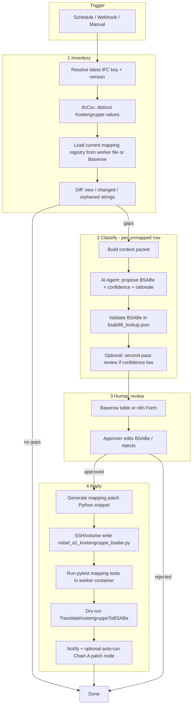

# n8n plan: Self-healing Kostengruppe → BSABe workflow

**Goal:** Detect new or changed `BIP.BSABe/Kostengruppe` values on incoming IFC models, propose BSABe mappings with AI + catalogues, update the gitignored mapping module, validate, and re-run the patch recipe — with human approval before production writes.

**Parent pipeline:** Nobel Center DCA (`lDABv1gGuH02O2sN`) — insert this workflow **beside** (not inside) Chain A so mapping maintenance does not block every upload.

---

## Principles

| Principle | Implementation |
|-----------|----------------|
| **Human gate** | No auto-merge to mapping file without review (Baserow row, Slack, or n8n Form) |
| **Gitignored mapping** | Patch `nobel_a1_kostengruppe_bsabe.py` on worker volume; version in Baserow audit table |
| **Idempotent inventory** | Compare ifccsv snapshot hash; skip if unchanged |
| **Fail safe** | Dry-run `TranslateKostengruppeToBSABe` before apply; block on `unmapped > 0` unless override |
| **Catalogue grounding** | AI prompt must cite `bsab96_byggdelar.tsv`, `din276_prefix_bsab_hints.tsv`, `bip_typbeteckningar_bsabe_only.txt` |

---

## Triggers

Choose one primary trigger (add others later):

1. **Schedule** — weekly, or daily during model drop window.
2. **Webhook** — after CDE upload / MinIO `uploads/*.ifc` event (filter `A1_2b_BIM_*`).
3. **Manual** — “Reconcile Kostengruppe mappings” button workflow.
4. **Post-DCA hook** — when Chain A completes but patch stats report `unmapped > 0` (read ifcpatch job result JSON).

---

## High-level flow



---

## Workflow A — `Kostengruppe Mapping Reconcile` (main)

### Node 1 — Trigger

- **Schedule:** `0 6 * * 1` (Monday 06:00) or manual.

### Node 2 — Config (Set)

```json
{
  "project_id": "nobel-a1",
  "ifc_glob": "uploads/A1_2b_BIM_XXX_0001_00.ifc",
  "mapping_module": "nobel_a1_kostengruppe_bsabe",
  "mapping_path": "/app/custom_recipes/mappings/nobel_a1_kostengruppe_bsabe.py",
  "reference_dir": "/app/custom_recipes/mappings/reference",
  "baserow_table_mappings": "<table_id>",
  "confidence_threshold": 0.85
}
```

### Node 3 — Resolve IFC input

- **StreamBIM / MinIO** — latest version of architectural model (same as DCA Chain A input).
- Output: `input_key`, `version_id`.

### Node 4 — IfcCsv inventory

- **ifcpipeline.ifcCsv** (or HTTP `/ifccsv`):

```json
{
  "query": "IfcElement",
  "attributes": "GlobalId,Class,BIP.BSABe/Kostengruppe,BIP.BSABe",
  "output_filename": "output/csv/kostengruppe_inventory_{{ $execution.id }}.csv"
}
```

### Node 5 — Aggregate distinct values (Code)

```javascript
// Output: { values: [{ raw, count, has_bsabe, classes: [] }], snapshot_hash }
```

- Group by exact `BIP.BSABe/Kostengruppe` string.
- Flag rows where `BIP.BSABe` already set (skip or audit only).

### Node 6 — Load known mappings (Code or HTTP)

- Read `KOSTENGRUPPE_REGISTRY` via small **sidecar HTTP** on ifcpatch-worker (optional) **or**
- Parse exported JSON from Baserow **Mapping audit** table (recommended for n8n-only ops).
- Compute:
  - `unmapped` — in IFC, not in registry
  - `stale` — in registry, not in IFC (optional warning)
  - `changed` — same prefix, different suffix string (ArchiCAD label drift)

### Node 7 — IF unmapped empty → Stop

### Node 8 — Loop unmapped (Split in Batches)

Batch size **5–10** strings (token limit for AI).

### Node 9 — Build AI context (Code)

For each `raw` Kostengruppe string, attach:

| Field | Source |
|-------|--------|
| `din_prefix` | First 3 digits |
| `din_hint` | Row from `din276_prefix_bsab_hints.tsv` |
| `bsab_candidates` | Keyword search in `bsab96_byggdelar.tsv` (top 8) |
| `bip_type_hints` | Rows from `bip_typbeteckningar_bsabe_only.txt` matching keywords |
| `ifc_classes` | Top 3 classes from inventory |
| `existing_prefix_default` | From current `PREFIX_DEFAULTS` |

### Node 10 — AI classify (OpenAI / Anthropic / Azure OpenAI)

**System prompt (stable):**

> You classify German DIN 276 Kostengruppe labels from IFC (`BIP.BSABe/Kostengruppe`) to Swedish `BIP.BSABe` (BSAB 96 byggdel **HUS**, Naviate). Output JSON only. Use only BSABe codes present in `bsab_candidates` or Naviate quick reference. Never invent codes. Prefer exact Naviate titles. For DIN 440 electrical use `63`, not roof codes. For DIN 361 structural roof use `27.G`; for 363 roof covering use `41.C`; for 364 roof lining use `41.D`.

**User payload:** context packet per string.

**Output schema:**

```json
{
  "raw": "342 Innenwände nicht tragend.ARC",
  "bsabe": "43.CB",
  "confidence": 0.92,
  "rationale": "DIN 342 nichttragende Innenwände → Naviate 43.CB Innerväggar",
  "contract_id_hint": "DE306",
  "in_dca_chain": true
}
```

### Node 11 — Validate BSABe (Code)

- Load `bsab96_lookup.json` `byggdel` keys.
- Reject if code missing → mark `needs_human`.
- If `confidence < threshold` → `needs_human`.

### Node 12 — Upsert Baserow review row

Table columns:

| Column | Type |
|--------|------|
| `kostengruppe_raw` | text, unique |
| `proposed_bsabe` | text |
| `confidence` | number |
| `rationale` | long text |
| `din_prefix` | text |
| `status` | single select: proposed / approved / rejected |
| `approved_bsabe` | text (human override) |
| `ifc_class_sample` | text |
| `execution_id` | text |
| `updated_at` | date |

### Node 13 — Wait for approval

- **Baserow trigger** on `status = approved` **or**
- **n8n Wait + Form** for low volume.

### Node 14 — Generate mapping update (AI or template Code)

Produce **Python dataclass rows** only (not full file rewrite):

```python
KostengruppeMapping(
    "new string from IFC",
    "43.CB",
    din_prefix="342",
    suffix="ARC",
    ...
),
```

### Node 15 — Apply mapping file (critical path)

**Option A (recommended):** Dedicated script on worker host

```bash
python3 scripts/merge_kostengruppe_mapping.py \
  --mapping nobel_a1_kostengruppe_bsabe \
  --from-baserow --status approved \
  --execution-id {{ $execution.id }}
```

**Option B:** n8n **Execute Command** on host with volume mount `custom_recipes/mappings/`.

**Option C:** Store mapping rows only in Baserow; worker loads at runtime (future recipe change).

### Node 16 — Verify

```bash
python3 -m pytest tests/test_nobel_a1_property_mappings.py -q
python3 scripts/prep_bsab_naviate_reference.py  # refresh nobel_bsabe_validation.txt
```

### Node 17 — Dry-run patch

- **ifcpipeline.ifcPatch**
  - recipe: `TranslateKostengruppeToBSABe`
  - `dry_run: true`
  - empty recipe args (see blank-arg fix)

Check logs: `unmapped=0`, `errors=0`.

### Node 18 — Notify

- Slack / Teams: summary + link to Baserow + validation file excerpt.
- If all green: optional **Execute Workflow** → DCA Chain A (or only re-run Translate node).

---

## Workflow B — `Kostengruppe Drift Alert` (lightweight)

Runs on **every** successful ifcpatch Translate job:

1. Parse worker log / job result for `unmapped=N`.
2. If `N > 0` → start Workflow A with that IFC key.
3. If `N == 0` → no-op.

Wire from existing DCA workflow **after** Translate Kostengruppe node (error branch).

---

## Baserow schema (mapping governance)

Database **291**, new table **Kostengruppe mappings** (sibling to delentreprenader 1182):

- Syncs human approvals with worker file merges.
- Keeps history when ArchiCAD renames a label (`342 …` → `342 … v2`).
- Links optional `contract_id_hint` for downstream ContractID rule suggestions (separate workflow).

---

## Scripts to add (ifcpatch-worker)

| Script | Role |
|--------|------|
| `scripts/inventory_kostengruppe.py` | ifccsv → `unmapped.json` vs mapping module |
| `scripts/merge_kostengruppe_mapping.py` | Insert/update rows in `nobel_a1_kostengruppe_bsabe.py` from Baserow JSON |
| `scripts/suggest_bsabe_for_kostengruppe.py` | CLI AI classify (same prompt as n8n) for local dev |
| Reuse `prep_bsab_naviate_reference.py` | Post-merge validation |

---

## n8n node checklist (copy to implementation ticket)

| # | Node type | Name |
|---|-----------|------|
| 1 | Schedule Trigger | Weekly reconcile |
| 2 | Set | Config |
| 3 | StreamBIM / HTTP | Latest IFC |
| 4 | IfcCsv | Inventory |
| 5 | Code | Distinct values + diff |
| 6 | IF | Has unmapped? |
| 7 | Split in Batches | Per Kostengruppe batch |
| 8 | Code | Build AI context |
| 9 | OpenAI / AI Agent | Classify BSABe |
| 10 | Code | Validate vs lookup.json |
| 11 | Baserow | Upsert proposed rows |
| 12 | Wait / Baserow trigger | Approval |
| 13 | Execute Command | merge_kostengruppe_mapping.py |
| 14 | Execute Command | pytest + prep_bsab |
| 15 | IfcPatch | Dry-run Translate |
| 16 | IF | unmapped == 0? |
| 17 | Slack | Notify team |
| 18 | Execute Workflow | Optional: DCA Chain A |

---

## Security and ops

- **API keys:** AI and Baserow in n8n credentials only.
- **Mapping file:** gitignored; backup Baserow + nightly copy from worker volume.
- **BSAB licence:** Naviate txt stays internal; AI context sends only relevant slices, not full 600-row dump per call.
- **No auto-deploy:** Recipe code changes (`TranslateKostengruppeToBSABe.py`) still go through git; only **mapping table** is self-healed.

---

## Phased rollout

| Phase | Deliverable |
|-------|-------------|
| **P0** | Baserow table + manual AI in chat + `merge_kostengruppe_mapping.py` |
| **P1** | Workflow A inventory + diff + Baserow propose (no auto-merge) |
| **P2** | AI classify node + validation + dry-run ifcpatch |
| **P3** | Workflow B drift alert on DCA; optional auto Chain A re-run |
| **P4** | ContractID rule suggestions from same inventory (separate agent) |

---

## Related docs

- [mappings/reference/README.md](../custom_recipes/mappings/reference/README.md) — Naviate BSAB + DIN references
- [.cursor/skills/ifcpatch-property-mapping/SKILL.md](../../.cursor/skills/ifcpatch-property-mapping/SKILL.md) — recipe conventions
- Nobel DCA workflow `lDABv1gGuH02O2sN` — production patch chain

---

## Mapping change log (2026-05-26)

Replaced invalid **32.G** (not in Naviate HUS) with Naviate-aligned codes:

| Kostengruppe | Old BSABe | New BSABe |
|--------------|-----------|-----------|
| `361 Dachkonstruktion.TWP` | 32.G | **27.G** |
| `361 Dächer.TWP` | 32.G | **27.G** |
| `363 Dachbelag/…ARC` | 32.G | **41.C** |
| `364 Dachbekleidung/…ARC` | 32.G | **41.D** |

`nobel_bsabe_validation.txt`: **20/20** exact Naviate matches after change.
